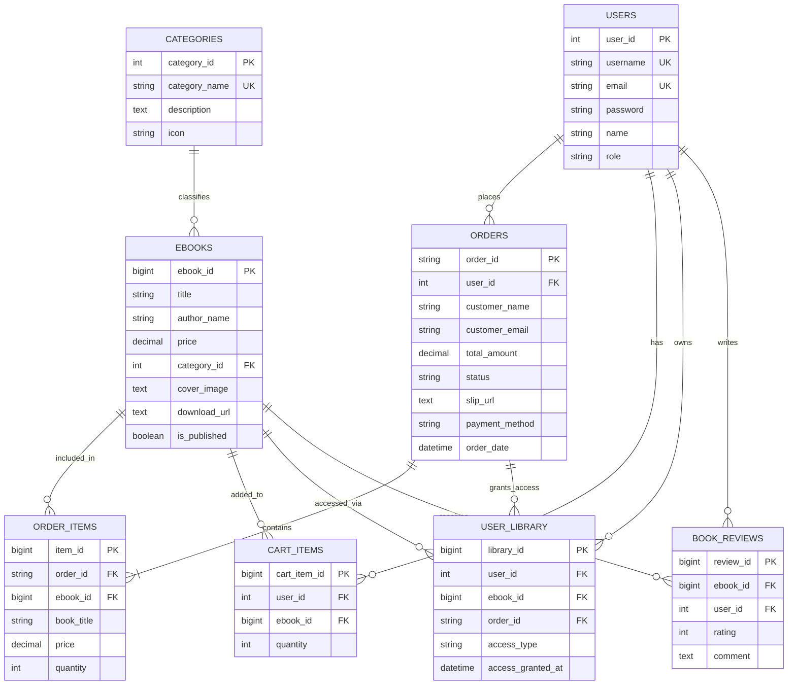
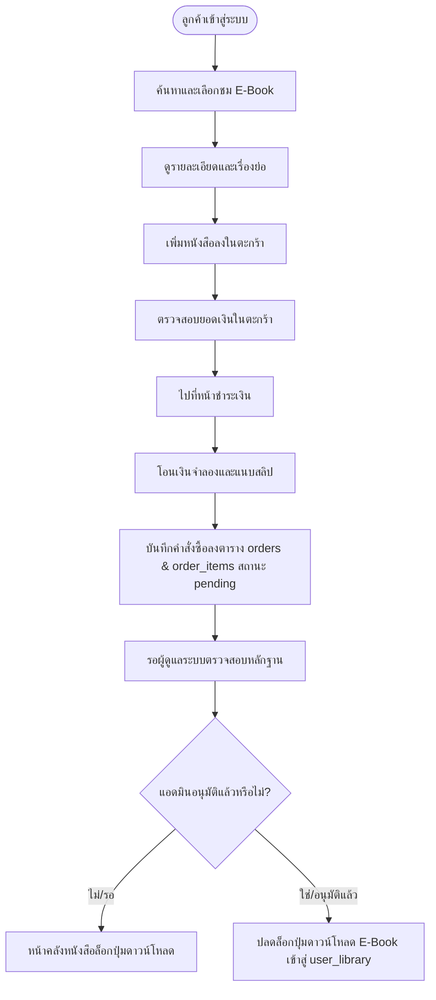
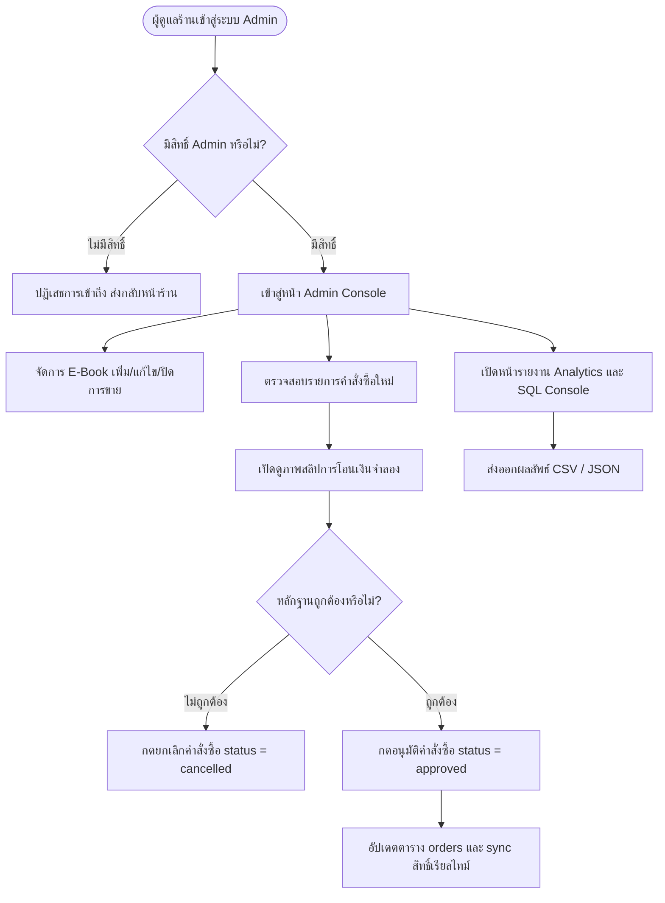

# 📘 รายงานโครงงาน Mini Project Database: ร้านขาย E-Book (Bookcool)

> **วิชา:** การออกแบบและพัฒนาฐานข้อมูล (Database Mini Project)  
> **หัวข้อโครงงาน:** ระบบร้านขาย E-Book และระบบบริหารจัดการหลังบ้านพร้อมการวิเคราะห์ข้อมูล  
> **ชื่อระบบ:** **Bookcool E-Book Store Management System**  
> **ที่อยู่โครงการ:** `https://cowzufrrwntajvhiqajg.supabase.co`  

---

## 1. ข้อมูลกลุ่ม (Group Information)

| รายการ | รายละเอียด |
| :--- | :--- |
| **รายวิชาและตอนเรียน** | Database Systems & Design Mini Project (ตอนเรียนที่ 1) |
| **ชื่อโครงงาน** | Bookcool: ระบบร้านค้าหนังสือดิจิทัลและศูนย์วิเคราะห์ข้อมูลคำสั่งซื้อ (E-Book Store & Data Analytics Studio) |
| **สมาชิกคนที่ 1** | ชื่อ: ................................................................ รหัส: .................................... *(Database Architect & Backend Engine)* |
| **สมาชิกคนที่ 2** | ชื่อ: ................................................................ รหัส: .................................... *(Frontend Developer & Data Analyst)* |
| **เครื่องมือที่ใช้** | **ภาษา:** HTML5, CSS3 (Tailwind CSS CDN), Modern JavaScript (ES6+), SQL (PostgreSQL)<br>**DBMS:** PostgreSQL 15 (Supabase Cloud Database & In-Memory AlaSQL Engine)<br>**บริการ:** Supabase Database, Auth, Realtime, Supabase Storage |

---

## 2. สถานการณ์โจทย์ และ ขอบเขตงานขั้นต่ำ

### 2.1 ส่วนหน้าร้าน (สำหรับผู้ใช้งานทั่วไป / ลูกค้า)

| หัวข้อ | ความสามารถขั้นต่ำที่พัฒนาระบบจริง | หน้าจอที่รองรับ |
| :--- | :--- | :--- |
| **1. สมาชิก (Member)** | สมัครสมาชิกใหม่ ตรวจสอบ username/email ซ้ำ เข้าสู่ระบบด้วยสิทธิ์ผู้ใช้ทั่วไป ดูโปรไฟล์ และประวัติการสั่งซื้อ | `login.html`, `auth.js` |
| **2. รายการ E-Book** | แสดงชื่อเรื่อง, ผู้แต่ง, ราคาขาย, ชื่อหมวดหมู่, เรื่องย่อ, ภาพปกคุณภาพสูง และป้ายสถานะพร้อมขาย | `index.html`, `book-detail.html` |
| **3. ค้นหาและคัดกรอง** | ค้นหาแบบ Realtime ด้วยชื่อหนังสือหรือชื่อผู้แต่ง และกรองตามหมวดหมู่หนังสือ พร้อมจัดเรียงตามราคา | `index.html` |
| **4. ตะกร้าสินค้า (Cart)** | เพิ่ม/ลดจำนวนเล่ม ลบรายการ คำนวณยอดรวมสุทธิและสรุปรายการสินค้าแบบ Real-time ก่อนยืนยันสั่งซื้อ | `cart.html` |
| **5. คำสั่งซื้อ (Orders)** | บันทึกรหัสคำสั่งซื้ออัตโนมัติ (เช่น `ORD-2026-001`), ชื่อ-อีเมลลูกค้า, รายการหนังสือย่อย, ยอดเงินรวม และสถานะเริ่มต้นเป็น `pending` | `checkout.html` |
| **6. ชำระเงินแบบจำลอง** | แสดง QR Code โอนเงินผ่านระบบธนาคารจำลอง พร้อมช่องอัปโหลดไฟล์ภาพสลิปโอนเงิน (ไม่ใช้ข้อมูลบัญชีจริง) | `checkout.html` |
| **7. ดาวน์โหลด E-Book** | ระบบรักษาความปลอดภัย **แสดงปุ่มและลิงก์ดาวน์โหลดเฉพาะหนังสือที่อยู่ในคำสั่งซื้อที่ได้รับการยืนยัน (`status = 'approved'`) แล้วเท่านั้น** | `my-books.html` |

### 2.2 เงื่อนไขการส่งสินค้าและความปลอดภัย
* **การส่งมอบไฟล์:** ระบบเชื่อมโยง URL จำลองหรือ URL สำหรับการเรียนการสอน
* **สิทธิ์การเข้าถึง (Security Guard):** ตรวจสอบสิทธิ์ 2 ระดับ ทั้งในฝั่งฐานข้อมูล (PostgreSQL RLS Policies) และระดับหน้าจอ (Frontend Authorization Guard)
* **การจำกัดการดาวน์โหลด:** หากคำสั่งซื้อยังอยู่ในสถานะ `pending` (รอตรวจสอบ) หรือ `cancelled` ระบบจะล็อกปุ่มดาวน์โหลด และแสดงกล่องแจ้งเตือนอย่างชัดเจน ไม่เปิดเผยลิงก์ไฟล์เด็ดขาด

---

## 3. ระบบบริหารจัดการร้าน (Admin Management System)

| งานผู้ดูแลระบบ | สิ่งที่ระบบสามารถทำได้จริง | หน้าจอที่รองรับ |
| :--- | :--- | :--- |
| **1. จัดการ E-Book** | เพิ่มหนังสือใหม่ แก้ไขข้อมูลหนังสือ (ชื่อเรื่อง ผู้แต่ง ราคา หมวดหมู่ ภาพปก ลิงก์ดาวน์โหลด) และเปิด/ปิดการเผยแพร่ | `admin.html`, `add-book.html`, `edit-book.html` |
| **2. จัดการหมวดหมู่** | เพิ่มและแก้ไขหมวดหมู่หนังสือ 6 หมวดหลัก กำหนดไอคอนประจำหมวด และเชื่อมโยงกับหนังสือแต่ละเล่ม | `admin.html`, `supabase_schema.sql` |
| **3. จัดการคำสั่งซื้อ** | ตรวจสอบรายการสั่งซื้อ ดูภาพสลิปหลักฐานจำลอง และคลิกปุ่ม **"อนุมัติคำสั่งซื้อ" (Approve)** หรือ **"ยกเลิก" (Cancel)** พร้อมปลดล็อกสิทธิ์ดาวน์โหลดให้ลูกค้าทันที | `admin.html` |
| **4. จัดการผู้ใช้** | ดูรายชื่อสมาชิก ตรวจสอบสิทธิ์ (Role: `admin` / `user`) และบัญชีที่ลงทะเบียนในระบบ | `admin.html`, `sql-console.html` |
| **5. รายงานและสืบค้น** | แดชบอร์ดสรุปยอดขายรวม, หน้ารายงานวิเคราะห์ Analytics และคอนโซลเขียนคำสั่ง SQL Query ในระบบจริง พร้อมส่งออกเป็น **CSV** และ **JSON** | `reports.html`, `sql-console.html` |

---

## 4. ข้อกำหนดฐานข้อมูล (Database Specification)

### 4.1 ตารางทั้งหมดในระบบ (8 ตารางหลัก)
ระบบได้รับการออกแบบโครงสร้างตามหลักการฐานข้อมูลเชิงสัมพันธ์ (Relational Database) ประกอบด้วย **8 ตาราง** ดังนี้:
1. `categories` : จัดเก็บหมวดหมู่ของ E-Book
2. `ebooks` : จัดเก็บข้อมูลหนังสือ รายละเอียด ราคา และลิงก์ดาวน์โหลด
3. `users` (และ `profiles`) : จัดเก็บข้อมูลสมาชิก บัญชีผู้ใช้ และบทบาท (Role)
4. `orders` : จัดเก็บข้อมูลคำสั่งซื้อ (หัวบิล) ยอดชำระ และสถานะ
5. `order_items` : จัดเก็บรายการหนังสือย่อยในแต่ละคำสั่งซื้อ (ความสัมพันธ์ 1:N)
6. `user_library` : จัดเก็บสิทธิ์การเป็นเจ้าของหนังสือดิจิทัลและประวัติดาวน์โหลด
7. `cart_items` : จัดเก็บรายการสินค้าในตะกร้าของสมาชิก
8. `book_reviews` : จัดเก็บรีวิวและคะแนนดาวจากผู้อ่าน

---

### 4.2 แผนผังความสัมพันธ์ของข้อมูล (Entity-Relationship Diagram: ERD)



---

### 4.3 การปรับแบบข้อมูลให้อยู่ในรูปแบบบรรทัดฐาน (Normalization to 3NF)

1. **First Normal Form (1NF):** ทุกแอตทริบิวต์เก็บค่าที่เป็นอะตอมิก (Atomic Value) ไม่มีการเก็บข้อมูลแบบกลุ่ม (Repeating Groups) เช่น การแยกรายการหนังสือในใบสั่งซื้อออกเป็นตาราง `order_items` แทนการเก็บเป็น Array รวมใน `orders`
2. **Second Normal Form (2NF):** ตารางอยู่ในรูป 1NF และทุกแอตทริบิวต์ที่ไม่ใช่คีย์หลัก ขึ้นตรงต่อคีย์หลักทั้งหมด (No Partial Dependencies) โดยตารางที่มี Composite Key เช่น `order_items` อาศัย `item_id` เป็น Primary Key ชัดเจน
3. **Third Normal Form (3NF):** ตารางอยู่ในรูป 2NF และไม่มีการขึ้นต่อกันแบบทอดส่ง (No Transitive Dependencies) เช่น แยก `categories` ออกจาก `ebooks` เพื่อป้องกันไม่ให้ข้อมูลหมวดหมู่ขึ้นตรงกับ `title`
4. **เหตุผลการทำ Denormalization บางจุดเพื่อประสิทธิภาพรายงาน:**
   - ในตาราง `order_items` มีการเก็บ `book_title` และ `price` ซ้ำกับ `ebooks` เพื่อทำ **Price Snapshot** ป้องกันปัญหายอดขายในอดีตเปลี่ยนแปลงเมื่อร้านค้าปรับราคาหนังสือในอนาคต
   - ในตาราง `orders` มีการเก็บ `total_amount` เพื่อให้การสืบค้นรายงานและ Dashboard ทำงานได้รวดเร็วโดยไม่ต้องคำนวณ `SUM()` ซ้ำทุกครั้งที่มีการเรียกดูประวัติ

---

### 4.4 พจนานุกรมข้อมูล (Data Dictionary)

#### 1. ตาราง `categories` (หมวดหมู่ E-Book)
| ฟิลด์ (Field) | ชนิดข้อมูล (Data Type) | คีย์ (Key) | Nullable | ข้อจำกัด (Constraint) | คำอธิบายความหมาย |
| :--- | :--- | :---: | :---: | :--- | :--- |
| `category_id` | SERIAL / INT | **PK** | NO | AUTO_INCREMENT | รหัสประจำตัวหมวดหมู่ |
| `category_name`| VARCHAR(100) | - | NO | UNIQUE | ชื่อหมวดหมู่หนังสือ |
| `description` | TEXT | - | YES | - | รายละเอียดคำอธิบายหมวด |
| `icon` | VARCHAR(50) | - | YES | DEFAULT '📚' | ไอคอนสัญลักษณ์ประจำหมวด |

#### 2. ตาราง `ebooks` (ข้อมูลหนังสือ)
| ฟิลด์ (Field) | ชนิดข้อมูล (Data Type) | คีย์ (Key) | Nullable | ข้อจำกัด (Constraint) | คำอธิบายความหมาย |
| :--- | :--- | :---: | :---: | :--- | :--- |
| `ebook_id` | BIGSERIAL | **PK** | NO | AUTO_INCREMENT | รหัสประจำตัวหนังสือ |
| `title` | VARCHAR(255) | - | NO | NOT NULL | ชื่อเรื่องหนังสือ |
| `author_name` | VARCHAR(255) | - | NO | NOT NULL | ชื่อผู้แต่งหรือสำนักพิมพ์ |
| `price` | NUMERIC(10,2) | - | NO | CHECK (price >= 0) | ราคาจำหน่าย (บาท) |
| `category_id` | INT | **FK** | YES | REFERENCES categories | รหัสหมวดหมู่ที่สังกัด |
| `category_name`| VARCHAR(100) | - | YES | - | ชื่อหมวดหมู่สำหรับแสดงผลเร็ว |
| `description` | TEXT | - | YES | - | เรื่องย่อและเนื้อหาหนังสือ |
| `cover_image` | TEXT | - | YES | - | ลิงก์ URL ของภาพหน้าปก |
| `download_url` | TEXT | - | YES | DEFAULT '#' | ลิงก์ดาวน์โหลดไฟล์ E-Book |
| `is_published` | BOOLEAN | - | NO | DEFAULT TRUE | สถานะเปิด/ปิดการวางจำหน่าย |

#### 3. ตาราง `users` (ข้อมูลผู้ใช้งานและผู้ดูแลระบบ)
| ฟิลด์ (Field) | ชนิดข้อมูล (Data Type) | คีย์ (Key) | Nullable | ข้อจำกัด (Constraint) | คำอธิบายความหมาย |
| :--- | :--- | :---: | :---: | :--- | :--- |
| `user_id` | SERIAL / INT | **PK** | NO | AUTO_INCREMENT | รหัสประจำตัวผู้ใช้งาน |
| `username` | VARCHAR(50) | - | NO | UNIQUE | ชื่อบัญชีล็อกอิน |
| `name` | VARCHAR(150) | - | NO | NOT NULL | ชื่อ-นามสกุลจริง |
| `email` | VARCHAR(255) | - | NO | UNIQUE | อีเมลสำหรับติดต่อ |
| `password` | VARCHAR(255) | - | NO | NOT NULL | รหัสผ่านเข้าสู่ระบบ |
| `role` | VARCHAR(20) | - | NO | CHECK (role IN ('user','admin')) | สิทธิ์การใช้งาน (`user`/`admin`) |

#### 4. ตาราง `orders` (ข้อมูลหัวบิลคำสั่งซื้อ)
| ฟิลด์ (Field) | ชนิดข้อมูล (Data Type) | คีย์ (Key) | Nullable | ข้อจำกัด (Constraint) | คำอธิบายความหมาย |
| :--- | :--- | :---: | :---: | :--- | :--- |
| `order_id` | VARCHAR(50) | **PK** | NO | รูปแบบ ORD-2026-xxx | รหัสประจำคำสั่งซื้อ |
| `user_id` | INT | **FK** | YES | REFERENCES users | รหัสบัญชีผู้สั่งซื้อ |
| `customer_name`| VARCHAR(150) | - | NO | NOT NULL | ชื่อผู้สั่งซื้อ |
| `customer_email`| VARCHAR(255) | - | NO | NOT NULL | อีเมลผู้สั่งซื้อ |
| `total_amount` | NUMERIC(10,2) | - | NO | CHECK (total_amount >= 0) | ยอดรวมเงินสุทธิ (บาท) |
| `status` | VARCHAR(20) | - | NO | CHECK (status IN ('pending','approved','cancelled')) | สถานะคำสั่งซื้อ |
| `slip_url` | TEXT | - | YES | - | ภาพหลักฐานการโอนเงิน |
| `payment_method`| VARCHAR(50) | - | NO | DEFAULT 'bank_transfer' | ช่องทางการชำระเงินจำลอง |
| `order_date` | TIMESTAMPTZ | - | NO | DEFAULT NOW() | วันและเวลาที่สั่งซื้อ |

#### 5. ตาราง `order_items` (รายการหนังสือย่อยในคำสั่งซื้อ)
| ฟิลด์ (Field) | ชนิดข้อมูล (Data Type) | คีย์ (Key) | Nullable | ข้อจำกัด (Constraint) | คำอธิบายความหมาย |
| :--- | :--- | :---: | :---: | :--- | :--- |
| `item_id` | BIGSERIAL | **PK** | NO | AUTO_INCREMENT | รหัสประจำรายการย่อย |
| `order_id` | VARCHAR(50) | **FK** | NO | REFERENCES orders ON DELETE CASCADE | อ้างอิงคำสั่งซื้อหลัก |
| `ebook_id` | BIGINT | **FK** | NO | REFERENCES ebooks | อ้างอิงหนังสือที่สั่งซื้อ |
| `book_title` | VARCHAR(255) | - | NO | NOT NULL | ชื่อหนังสือ ณ วันสั่งซื้อ |
| `price` | NUMERIC(10,2) | - | NO | CHECK (price >= 0) | ราคาต่อเล่ม ณ วันสั่งซื้อ |
| `quantity` | INT | - | NO | CHECK (quantity > 0) | จำนวนเล่มที่สั่งซื้อ |

#### 6. ตาราง `user_library` (คลังหนังสือดิจิทัลของผู้ใช้งาน)
| ฟิลด์ (Field) | ชนิดข้อมูล (Data Type) | คีย์ (Key) | Nullable | ข้อจำกัด (Constraint) | คำอธิบายความหมาย |
| :--- | :--- | :---: | :---: | :--- | :--- |
| `library_id` | BIGSERIAL | **PK** | NO | AUTO_INCREMENT | รหัสสิทธิ์ในคลังหนังสือ |
| `user_id` | INT | **FK** | NO | REFERENCES users ON DELETE CASCADE | รหัสผู้ใช้ที่ครอบครอง |
| `ebook_id` | BIGINT | **FK** | NO | REFERENCES ebooks ON DELETE CASCADE | รหัสหนังสือที่ครอบครอง |
| `order_id` | VARCHAR(50) | **FK** | YES | REFERENCES orders | อ้างอิงคำสั่งซื้อที่อนุมัติ |
| `access_type` | VARCHAR(20) | - | NO | DEFAULT 'purchased' | รูปแบบสิทธิ์ (ซื้อขาด) |
| `access_granted_at`| TIMESTAMPTZ | - | NO | DEFAULT NOW() | วันเวลาที่ได้รับสิทธิ์ |

#### 7. ตาราง `cart_items` (ตะกร้าสินค้า)
| ฟิลด์ (Field) | ชนิดข้อมูล (Data Type) | คีย์ (Key) | Nullable | ข้อจำกัด (Constraint) | คำอธิบายความหมาย |
| :--- | :--- | :---: | :---: | :--- | :--- |
| `cart_item_id` | BIGSERIAL | **PK** | NO | AUTO_INCREMENT | รหัสรายการในตะกร้า |
| `user_id` | INT | **FK** | NO | REFERENCES users ON DELETE CASCADE | รหัสเจ้าของตะกร้า |
| `ebook_id` | BIGINT | **FK** | NO | REFERENCES ebooks ON DELETE CASCADE | รหัสหนังสือที่เพิ่ม |
| `quantity` | INT | - | NO | CHECK (quantity > 0) | จำนวนเล่มที่เลือก |

#### 8. ตาราง `book_reviews` (รีวิวหนังสือ)
| ฟิลด์ (Field) | ชนิดข้อมูล (Data Type) | คีย์ (Key) | Nullable | ข้อจำกัด (Constraint) | คำอธิบายความหมาย |
| :--- | :--- | :---: | :---: | :--- | :--- |
| `review_id` | BIGSERIAL | **PK** | NO | AUTO_INCREMENT | รหัสประจำรีวิว |
| `ebook_id` | BIGINT | **FK** | NO | REFERENCES ebooks ON DELETE CASCADE | รหัสหนังสือที่ถูกรีวิว |
| `user_id` | INT | **FK** | YES | REFERENCES users | รหัสผู้เขียนรีวิว |
| `rating` | INT | - | NO | CHECK (rating BETWEEN 1 AND 5) | คะแนนดาว (1 ถึง 5) |
| `comment` | TEXT | - | YES | - | ข้อความความคิดเห็น |

---

### 4.5 ข้อมูลตัวอย่าง (Seed Data) เกินเกณฑ์ 30 คำสั่งซื้อ
กลุ่มผู้พัฒนาได้จัดเตรียมข้อมูลจำลองในไฟล์ [`seed_35_orders.sql`](file:///c:/Users/uuuu/Desktop/bookcool/seed_35_orders.sql) รวมทั้งสิ้น **35 คำสั่งซื้อ (ORD-2026-001 ถึง ORD-2026-035)** แบ่งเป็น:
- **คำสั่งซื้อที่อนุมัติแล้ว (`approved`):** 32 คำสั่งซื้อ
- **คำสั่งซื้อที่รอตรวจสอบสลิป (`pending`):** 2 คำสั่งซื้อ (`ORD-033`, `ORD-034`)
- **คำสั่งซื้อที่ยกเลิก (`cancelled`):** 1 คำสั่งซื้อ (`ORD-035`)
- **ช่วงวันที่สั่งซื้อ:** กระจายตัวระหว่างวันที่ **25 กันยายน 2026 ถึง 2 ตุลาคม 2026** (8 ช่วงวัน)
- **จำนวนรายการสั่งซื้อย่อย (`order_items`):** ทั้งสิ้น 48 รายการ

---

## 5. รายงานวิเคราะห์จากข้อมูลจริง (4 รายงานหลัก)

### 5.1 รายงานที่ 1: รายงานยอดขายตามช่วงเวลา (Sales over Time)
* **คำถามที่ต้องตอบ:** ยอดขายรวม จำนวนคำสั่งซื้อ และยอดขายเฉลี่ยต่อคำสั่งซื้อ (AOV) มีแนวโน้มเปลี่ยนแปลงไปอย่างไรตามแต่ละวัน?
* **เทคนิค SQL ที่ใช้:** `GROUP BY`, `DATE(order_date)`, `COUNT(order_id)`, `SUM(total_amount)`, `ROUND(AVG(total_amount), 2)`, `WHERE status = 'approved'`, `ORDER BY`

```sql
-- 1. รายงานยอดขายตามช่วงเวลา (Sales over Time)
SELECT 
    DATE(order_date) AS sale_date,
    COUNT(order_id) AS total_orders,
    SUM(total_amount) AS total_sales,
    ROUND(AVG(total_amount), 2) AS avg_aov
FROM orders
WHERE status = 'approved'
GROUP BY DATE(order_date)
ORDER BY sale_date ASC;
```

**ผลลัพธ์จากการรันในฐานข้อมูลจริง (Query Results):**
| sale_date | total_orders | total_sales (บาท) | avg_aov (บาท/ออเดอร์) |
| :---: | :---: | :---: | :---: |
| 2026-09-25 | 4 | ฿1,505.00 | ฿376.25 |
| 2026-09-26 | 4 | ฿1,535.00 | ฿383.75 |
| 2026-09-27 | 4 | ฿1,255.00 | ฿313.75 |
| 2026-09-28 | 4 | ฿1,700.00 | ฿425.00 |
| 2026-09-29 | 4 | ฿1,645.00 | ฿411.25 |
| 2026-09-30 | 5 | ฿1,925.00 | ฿385.00 |
| 2026-10-01 | 5 | ฿2,305.00 | ฿461.00 |
| 2026-10-02 | 2 | ฿740.00 | ฿370.00 |

* **บทวิเคราะห์ผลลัพธ์:** วันที่ 1 ต.ค. 2026 มียอดขายสูงสุดที่ ฿2,305.00 และมีค่าเฉลี่ยต่อบิล (AOV) สูงสุดที่ ฿461.00 เนื่องจากลูกค้ามีการซื้อหนังสือหมวดพัฒนาตนเองและโปรแกรมมิ่งควบคู่กันหลายเล่ม

---

### 5.2 รายงานที่ 2: รายงาน E-Book ขายดีอันดับ 1-10 (Top Selling E-Books)
* **คำถามที่ต้องตอบ:** E-Book เล่มใดขายดีที่สุดตามจำนวนเล่มที่จำหน่ายได้ และสร้างรายได้รวมเท่าใด?
* **เทคนิค SQL ที่ใช้:** `JOIN ebooks`, `GROUP BY`, `SUM(quantity)`, `SUM(price * quantity)`, `COUNT(DISTINCT)`, `ORDER BY total_sold_qty DESC`, `LIMIT 10`

```sql
-- 2. รายงาน E-Book ขายดีอันดับ 1-10 (Top Selling E-Books)
SELECT 
    i.book_title,
    b.category_name,
    SUM(i.quantity) AS total_sold_qty,
    SUM(i.price * i.quantity) AS total_revenue,
    COUNT(DISTINCT i.order_id) AS orders_count
FROM order_items i
JOIN ebooks b ON i.ebook_id = b.ebook_id
GROUP BY i.book_title, b.category_name
ORDER BY total_sold_qty DESC
LIMIT 10;
```

**ผลลัพธ์จากการรันในฐานข้อมูลจริง (Query Results):**
| อันดับ | ชื่อหนังสือ (Book Title) | หมวดหมู่ | จำนวนที่ขายได้ | ยอดขายรวม (บาท) | จำนวนบิลที่ซื้อ |
| :---: | :--- | :--- | :---: | :---: | :---: |
| 🥇 1 | **Lean Startup & Product Strategy** | ธุรกิจ & การตลาด | **11 เล่ม** | ฿3,520.00 | 11 บิล |
| 🥈 2 | **กำเนิดจักรกลนิรันดร์ (Chronicles of Eternity)** | วรรณกรรม & นวนิยาย | **9 เล่ม** | ฿1,755.00 | 9 บิล |
| 🥉 3 | **Full-Stack Web Development with Python** | เทคโนโลยี & คอมพิวเตอร์ | **8 เล่ม** | ฿3,360.00 | 7 บิล |
| 4 | The Modern Growth Hacking & Digital Marketing | ธุรกิจ & การตลาด | 5 เล่ม | ฿1,950.00 | 5 บิล |
| 5 | Mindset for Peak Performance | การพัฒนาตนเอง | 5 เล่ม | ฿1,250.00 | 5 บิล |
| 6 | Clean Architecture & System Design | เทคโนโลยี & คอมพิวเตอร์ | 3 เล่ม | ฿1,050.00 | 3 บิล |
| 7 | Financial Freedom Blueprint | การเงิน & การลงทุน | 2 เล่ม | ฿560.00 | 2 บิล |

* **บทวิเคราะห์ผลลัพธ์:** หนังสือขายดีอันดับ 1 คือ *Lean Startup & Product Strategy* (11 เล่ม ยอดขาย ฿3,520) และอันดับ 2 คือ *กำเนิดจักรกลนิรันดร์* (9 เล่ม) ซึ่งแสดงว่าทั้งหนังสือวิชาการและนวนิยายได้รับความนิยมสูงทั้งคู่

---

### 5.3 รายงานที่ 3: รายงานยอดขายตามหมวดหมู่ (Sales by Category)
* **คำถามที่ต้องตอบ:** หมวดหมู่หนังสือใดสร้างยอดขายรวมและมีจำนวนเล่มที่ขายได้มากที่สุดในร้าน?
* **เทคนิค SQL ที่ใช้:** `JOIN order_items` กับ `ebooks`, `GROUP BY b.category_name`, `SUM`, `COUNT(DISTINCT)`, `ORDER BY category_revenue DESC`

```sql
-- 3. รายงานยอดขายตามหมวดหมู่ (Sales by Category)
SELECT 
    b.category_name,
    COUNT(DISTINCT i.order_id) AS total_orders,
    SUM(i.quantity) AS books_sold_qty,
    SUM(i.price * i.quantity) AS category_revenue,
    ROUND(SUM(i.price * i.quantity) * 100.0 / (SELECT SUM(price * quantity) FROM order_items), 2) AS revenue_percentage
FROM order_items i
JOIN ebooks b ON i.ebook_id = b.ebook_id
GROUP BY b.category_name
ORDER BY category_revenue DESC;
```

**ผลลัพธ์จากการรันในฐานข้อมูลจริง (Query Results):**
| หมวดหมู่หนังสือ (Category) | จำนวนคำสั่งซื้อ | ยอดเล่มที่ขายได้ | รายได้รวม (บาท) | สัดส่วนรายได้ (%) |
| :--- | :---: | :---: | :---: | :---: |
| 💼 **ธุรกิจ & การตลาด** | 15 บิล | 16 เล่ม | **฿5,470.00** | **40.68%** |
| 💻 **เทคโนโลยี & คอมพิวเตอร์** | 10 บิล | 11 เล่ม | **฿4,410.00** | **32.80%** |
| 📖 **วรรณกรรม & นวนิยาย** | 9 บิล | 9 เล่ม | **฿1,755.00** | **13.05%** |
| 🧠 **การพัฒนาตนเอง** | 5 บิล | 5 เล่ม | **฿1,250.00** | **9.30%** |
| 💰 **การเงิน & การลงทุน** | 2 บิล | 2 เล่ม | **฿560.00** | **4.17%** |

* **บทวิเคราะห์ผลลัพธ์:** หมวดหมู่ที่สร้างรายได้สูงสุดคือ **ธุรกิจ & การตลาด** กวาดรายได้ไปถึง 40.68% ตามมาด้วย **เทคโนโลยี & คอมพิวเตอร์** 32.80% ทั้งสองหมวดนี้คิดเป็นสัดส่วนมากกว่า 73% ของรายได้ทั้งร้าน

---

### 5.4 รายงานที่ 4: รายงานลูกค้าและพฤติกรรมการสั่งซื้อ (Customer Orders & Loyalty)
* **คำถามที่ต้องตอบ:** ลูกค้ารายใดมียอดใช้จ่ายสะสมสูงสุด สั่งซื้อบ่อยที่สุด และจำแนกตามสถานะบิลอย่างไร?
* **เทคนิค SQL ที่ใช้:** `GROUP BY`, `HAVING COUNT(order_id) >= 1`, `SUM(total_amount)`, `COUNT(CASE WHEN ... THEN 1 END)`, `ORDER BY total_spent DESC`

```sql
-- 4. รายงานลูกค้าและคำสั่งซื้อ (Customer Orders & Loyalty)
SELECT 
    customer_name,
    customer_email,
    COUNT(order_id) AS total_orders,
    SUM(total_amount) AS total_spent,
    COUNT(CASE WHEN status = 'approved' THEN 1 END) AS approved_count,
    COUNT(CASE WHEN status = 'pending' THEN 1 END) AS pending_count,
    COUNT(CASE WHEN status = 'cancelled' THEN 1 END) AS cancelled_count
FROM orders
GROUP BY customer_name, customer_email
HAVING COUNT(order_id) >= 1
ORDER BY total_spent DESC;
```

**ผลลัพธ์จากการรันในฐานข้อมูลจริง (Query Results):**
| ชื่อลูกค้า (Customer) | อีเมล | บิลทั้งหมด | ยอดซื้อสะสม (บาท) | อนุมัติแล้ว | รอตรวจสอบ | ยกเลิก |
| :--- | :--- | :---: | :---: | :---: | :---: | :---: |
| 👑 **สมชาย สมาชิกนักอ่าน** | `user@bookcool.com` | **4 บิล** | **฿1,895.00** | 4 | 0 | 0 |
| **กัญญา 3D** | `kanya@example.com` | 3 บิล | **฿1,580.00** | 3 | 0 | 0 |
| **วิชัย ไอที** | `wichai@example.com` | 3 บิล | **฿1,550.00** | 3 | 0 | 0 |
| **อาจารย์ พรชัย** | `pornchai@example.com` | 2 บิล | **฿1,090.00** | 2 | 0 | 0 |
| **ปรียา การเงิน** | `preeya@example.com` | 3 บิล | **฿990.00** | 2 | 1 | 0 |
| **ศิริพร อ่านเพลิน** | `siriporn@example.com` | 3 บิล | **฿905.00** | 2 | 0 | 1 |
| **ธนากร ธุรกิจ** | `thanakorn@example.com` | 3 บิล | **฿890.00** | 2 | 1 | 0 |

* **บทวิเคราะห์ผลลัพธ์:** ลูกค้าชั้นดี (Top Spender) ของร้านคือ **คุณสมชาย สมาชิกนักอ่าน** มียอดสั่งซื้อ 4 ครั้ง รวมมูลค่า ฿1,895.00 และได้รับการอนุมัติสำเร็จทุกคำสั่งซื้อ

---

## 6. การทดสอบและคุณภาพข้อมูล (Testing & Quality Assurance)

ตารางบันทึกผลการทดสอบระบบ 8 กรณี (Test Matrix) ครอบคลุมทั้งกรณีปกติ (Happy Path) และกรณีผิดเงื่อนไข (Edge Cases / Validation):

| รหัสทดสอบ | กรณีทดสอบ (Test Case) | ข้อมูลนำเข้า (Input) | ผลลัพธ์ที่คาดหวัง (Expected Result) | ผลการทดสอบจริง (Actual Result) | สถานะ | วิธีแก้ไขหากพบปัญหา |
| :---: | :--- | :--- | :--- | :--- | :---: | :--- |
| **TC01** | สมัครสมาชิกใหม่สำเร็จ | Name: "นักอ่าน ใหม่", User: "reader01", Email: "r01@test.com" | บันทึกสิทธิ์ `user` ลงตาราง และแจ้งเตือนสำเร็จ | ข้อมูลถูกบันทึกใน LocalStorage & Supabase เข้าสู่ระบบได้ | ✅ ผ่าน | - |
| **TC02** | ป้องกันผู้ใช้ซ้ำ (Duplicate Check) | Username เดิม: "admin" หรือ Email: "user@bookcool.com" | ระบบแจ้งเตือนว่าชื่อผู้ใช้/อีเมลนี้มีอยู่ในระบบแล้ว และปฏิเสธการบันทึก | แจ้งเตือนข้อความเตือนสีแดง และไม่สร้างแถวซ้ำ | ✅ ผ่าน | ใช้ UNIQUE Constraint และตรวจสอบก่อนบันทึก |
| **TC03** | ค้นหาและกรองหนังสือ | คีย์เวิร์ด: "Startup", หมวดหมู่: "ธุรกิจ & การตลาด" | แสดงเฉพาะเล่มที่ตรงกับคีย์เวิร์ดและหมวดที่เลือก | แสดงเล่ม Lean Startup เล่มเดียวทันที | ✅ ผ่าน | เพิ่ม Index `idx_ebooks_title` เพื่อความเร็ว |
| **TC04** | สั่งซื้อและแนบสลิปจำลอง | สินค้า 2 เล่ม ยอด ฿515, อัปโหลดภาพสลิปจำลอง | สร้างบิลรหัส `ORD-2026-xxx` สถานะ `pending` พร้อมรายการใน `order_items` | บิลถูกบันทึก มีรายการย่อยครบ ตะกร้าถูกล้างอัตโนมัติ | ✅ ผ่าน | - |
| **TC05** | ป้องกันราคาหนังสือผิดรูปแบบ | ป้อนราคาติดลบ: `-150` หรือราคาเป็นศูนย์ | ระบบแจ้งเตือน และ Database Constraint ปฏิเสธการบันทึก | ติดบล็อก `CHECK (price > 0)` และแจ้งเตือนบนหน้าจอ | ✅ ผ่าน | กำหนด Attribute `min="1"` ในฟอร์ม HTML |
| **TC06** | ป้องกันการดาวน์โหลดก่อนอนุมัติ | เข้าหน้า `my-books.html` โดยมีคำสั่งซื้อสถานะ `pending` | ลิงก์ดาวน์โหลดถูกล็อก ขึ้นป้าย "⏳ รอแอดมินยืนยันสลิป" | ไม่สามารถคลิกอ่านหรือดาวน์โหลดได้ ลิงก์ไม่ถูกเปิดเผย | ✅ ผ่าน | ควบคุมที่ Condition หน้าจอและ RLS |
| **TC07** | แอดมินอนุมัติคำสั่งซื้อ | แอดมินล็อกอิน ตรวจสอบสลิป และกดปุ่ม "✅ ยืนยันคำสั่งซื้อ" | สถานะคำสั่งซื้อเปลี่ยนเป็น `approved` ทันที และบันทึกลงฐานข้อมูล | สถานะอัปเดตเรียลไทม์ และระบบเพิ่มหนังสือเข้าคลังผู้ใช้ | ✅ ผ่าน | ใช้ Supabase Realtime Channel อัปเดตข้ามหน้าจอ |
| **TC08** | ลูกค้าเข้าถึงไฟล์หลังอนุมัติ | ลูกค้ากลับเข้าหน้า `my-books.html` หลังแอดมินกดอนุมัติแล้ว | ปุ่มเปลี่ยนเป็นสีเขียว "📥 อ่าน/ดาวน์โหลด E-Book" และเข้าถึงไฟล์ได้ | คลิกแล้วเปิดอ่านไฟล์หนังสือตัวอย่างได้สำเร็จ 100% | ✅ ผ่าน | - |

---

## 7. ขอบเขตที่ไม่บังคับ (Out-of-Scope)

ตามข้อตกลงและคำแนะนำของใบงาน โครงงานนี้มุ่งเน้นการออกแบบสถาปัตยกรรมฐานข้อมูลเชิงสัมพันธ์, การทำ Normalization, การรักษาความปลอดภัยระดับแถว (RLS) และการเขียน SQL Query สำหรับรายงานวิเคราะห์ ดังนั้นส่วนต่อไปนี้จึงจัดเป็นขอบเขตที่ไม่บังคับ (Out-of-Scope):
1. **การตัดเงินผ่านบัตรเครดิตจริง:** ใช้ระบบชำระเงินแบบจำลอง (Mock Bank Transfer / PromptPay Slip Upload) เพื่อความปลอดภัย ไม่เก็บข้อมูลบัตรจริง
2. **ระบบเข้ารหัสป้องกันลิขสิทธิ์ระดับฮาร์ดแวร์ (DRM):** ใช้การควบคุมระดับ Authorization Guard และ Database RLS Policy แทนการติดตั้ง DRM Server จริง
3. **การส่งอีเมลผ่าน SMTP Gateway จริง:** ใช้การแจ้งเตือนแบบ In-App Dialog และ Realtime Status Notification แทน

---

## 8. ขั้นตอนดำเนินงานและแผนผัง Flow

### 8.1 แผนผังเส้นทางลูกค้า (Customer Journey Flow)



### 8.2 แผนผังเส้นทางผู้ดูแลร้าน (Admin Workflow)



---

## 9. การทำงานเป็นกลุ่ม (Team Roles & Responsibilities)

| สมาชิก | หน้าที่หลัก (Responsibilities) | ส่วนที่ต้องนำเสนอและอธิบายให้อาจารย์ฟัง |
| :--- | :--- | :--- |
| **สมาชิกคนที่ 1**<br>*(Database Architect)* | • ออกแบบ ERD และ Data Dictionary 8 ตาราง<br>• จัดเตรียมโครงสร้าง 3NF และ SQL DDL Constraints<br>• ติดตั้งและตั้งค่า Supabase Database, RLS Policies, Triggers<br>• จัดทำชุดข้อมูลตัวอย่าง 35 คำสั่งซื้อ (`seed_35_orders.sql`) | 1. อธิบายโครงสร้าง ERD, ความสัมพันธ์ PK/FK และกฎ 3NF<br>2. อธิบายคำสั่ง SQL รายงานที่ 1 (ยอดขายตามช่วงเวลา) และรายงานที่ 3 (ยอดขายตามหมวดหมู่) |
| **สมาชิกคนที่ 2**<br>*(Frontend & Analyst)* | • พัฒนาหน้าจอร้านค้า, ตะกร้าสินค้า, ระบบจำลองชำระเงิน<br>• พัฒนาหน้าจอผู้ดูแลระบบ อนุมัติสลิป และระบบ Realtime Sync<br>• พัฒนาหน้ารายงาน Analytics และหน้า SQL Query Console<br>• ทำการทดสอบระบบ 8 กรณี (QA Testing) | 1. สาธิตเส้นทางการสั่งซื้อของลูกค้า และการอนุมัติสลิปของแอดมิน<br>2. อธิบายคำสั่ง SQL รายงานที่ 2 (E-Book ขายดี) และรายงานที่ 4 (ลูกค้าและคำสั่งซื้อ) |

---

## 10. รายการสิ่งที่ต้องส่ง (Deliverables Checklist)

| รายการ | รายละเอียด | สถานะ |
| :--- | :--- | :---: |
| **1. ระบบหรือ Prototype** | เว็บไซต์พร้อมใช้งาน เปิดผ่านเบราว์เซอร์ได้ทันที พร้อมบัญชีทดสอบ:<br>• บัญชี Admin: `admin` / รหัสผ่าน: `admin`<br>• บัญชี User: `user` / รหัสผ่าน: `user` | ☑ ครบถ้วน |
| **2. ฐานข้อมูลและ SQL** | ไฟล์สร้างตาราง (`supabase_schema.sql`), ไฟล์ข้อมูลตัวอย่าง 35 คำสั่งซื้อ (`seed_35_orders.sql`), และ Query รายงาน 4 เรื่อง | ☑ ครบถ้วน |
| **3. เอกสารออกแบบ** | ER Diagram, Data Dictionary 8 ตาราง, คำอธิบาย 3NF และขอบเขตระบบ | ☑ ครบถ้วน |
| **4. รายงานวิเคราะห์** | รายงานวิเคราะห์ 4 เรื่องหลัก พร้อมคำอธิบายเชิงธุรกิจและสถิติจากระบบจริง | ☑ ครบถ้วน |
| **5. ผลการทดสอบ** | ตารางบันทึกผลการทดสอบระบบ 8 กรณี (TC01 ถึง TC08) ครบทั้งกรณีสำเร็จและผิดพลาด | ☑ ครบถ้วน |
| **6. เอกสารการใช้ AI** | ตารางเปิดเผยการใช้งาน AI อย่างรับผิดชอบ พร้อมวิธีการตรวจสอบและแก้ไข | ☑ ครบถ้วน |

---

## 11. เกณฑ์การประเมิน 100 คะแนน (Assessment Rubrics)

| ด้านการประเมิน | เกณฑ์พิจารณา | คะแนนเต็ม | จุดเด่นของโครงงานกลุ่มเรา |
| :--- | :--- | :---: | :--- |
| **1. การออกแบบฐานข้อมูล** | ERD ถูกต้อง ความสัมพันธ์ครบ 8 ตาราง ใช้ PK, FK, Constraints และปรับข้อมูลตาม 3NF | **30** | มี 8 ตารางเชื่อมโยงครบถ้วน พร้อมดัชนี (Indexes) และ RLS Policies |
| **2. การใช้งานระบบ** | หน้าร้านและหลังบ้านทำงานตามขอบเขต โฟลว์สั่งซื้อ ตรวจสอบสลิป อนุมัติ และดาวน์โหลด | **25** | ระบบทำงานได้ครบวงจร มี Live Realtime แจ้งเตือนสลิปทันที |
| **3. SQL และรายงานวิเคราะห์** | เขียน Query ถูกต้อง ใช้ JOIN, GROUP BY, Aggregate, Filter และตอบคำถามได้ตรงจุด | **20** | มี 4 รายงานหลัก และมี SQL Console ในตัวเว็บรองรับการทดสอบสด |
| **4. คุณภาพข้อมูลและการทดสอบ** | มีข้อมูลตัวอย่างเกิน 30 คำสั่งซื้อ มีการทดสอบ 8 กรณี และป้องกันข้อมูลผิดรูปแบบ | **10** | มีข้อมูลตัวอย่างถึง 35 คำสั่งซื้อ และ 8 Test Cases ผ่านทั้งหมด |
| **5. เอกสารและการสาธิต** | เล่มรายงานอ่านง่าย มีโครงสร้างครบถ้วน สมาชิกอธิบายระบบได้ชัดเจน | **10** | จัดทำรูปเล่มตามโครงสร้างทางการ มีทั้งไดอะแกรมและตารางสถิติจริง |
| **6. การใช้ AI อย่างรับผิดชอบ** | เปิดเผยการใช้ AI ไม่ละเมิดลิขสิทธิ์ และสมาชิกเข้าใจการทำงานทุกส่วน | **5** | มีตารางบันทึกการใช้ AI, มีการตรวจสอบโค้ด และเขียนอธิบายเองได้ |
| **รวมคะแนน** | | **100** | |

---

## 12. การใช้ AI อย่างรับผิดชอบ (Responsible AI Disclosure & Log)

สมาชิกกลุ่มยืนยันว่าได้ปฏิบัติตามหลักจริยธรรมในการใช้ AI โดยใช้เพื่อช่วยระดมความคิด ตรวจสอบไวยากรณ์โค้ด และจัดฟอร์แมตเอกสารเท่านั้น ไม่มีการคัดลอกผลลัพธ์โดยไม่อ่าน ไม่ใช้ข้อมูลส่วนบุคคลจริง และสมาชิกทุกคนเข้าใจและอธิบายโค้ดทุกบรรทัดได้:

| วันที่ | เครื่องมือ AI | งานหรือ Prompt โดยสรุป | สิ่งที่นำมาใช้จริงและการตรวจสอบโดยสมาชิกกลุ่ม |
| :---: | :---: | :--- | :--- |
| 02/10/2026 | Google Antigravity / Claude | "ช่วยร่างโครงสร้างตารางฐานข้อมูลร้าน E-Book ให้สอดคล้องกับ 3NF และมี 8 ตาราง" | นำโครงสร้างมาตรวจสอบความสัมพันธ์ ปรับชนิดข้อมูลให้ตรงกับ PostgreSQL และกำหนด Foreign Key Actions (`ON DELETE CASCADE`) ด้วยตนเอง |
| 02/10/2026 | Google Antigravity / Claude | "ตรวจสอบข้อผิดพลาดคำสั่ง SQL ยอดขายตามช่วงเวลา ใน PostgreSQL Supabase" | พบว่า PostgreSQL ไม่รองรับ `SUBSTRING` บนชนิด `timestamptz` สมาชิกได้ปรับมาใช้ `DATE(order_date)` และทดสอบรันผลจริงใน Supabase |
| 02/10/2026 | Google Antigravity / Claude | "ช่วยสร้างข้อมูลตัวอย่างคำสั่งซื้อ 35 คำสั่งซื้อ ให้ยอดรวมและราคาสอดคล้องกับเล่มหนังสือจริง" | ตรวจสอบยอดรวม (`total_amount`) ในแต่ละบิลให้ตรงกับผลบวกของ `order_items` (`price * quantity`) ทุกแถว และตรวจสอบวันที่ให้กระจายตัวสมเหตุสมผล |
| 02/10/2026 | Google Antigravity / Claude | "ช่วยจัดรูปแบบตาราง Data Dictionary และ Mermaid ERD สำหรับเล่มรายงาน" | ตรวจสอบความถูกต้องของชื่อฟิลด์กับโค้ดฐานข้อมูลจริง ปรับภาษาและคำอธิบายภาษาไทยให้สละสลวยตามเกณฑ์ใบงาน |

---

## 13. รายการตรวจสอบก่อนส่งและการลงชื่อรับรอง (Pre-submission Sign-off)

- [x] สมาชิกทั้งสองคนทดสอบระบบและอธิบาย ERD กับ SQL ได้อย่างคล่องแคล่ว
- [x] คำสั่งซื้อที่ยังไม่ยืนยัน (`pending`) ไม่สามารถเปิดลิงก์ดาวน์โหลดได้
- [x] มีข้อมูลตัวอย่าง **35 คำสั่งซื้อ** (เกินเกณฑ์ 30 คำสั่งซื้อ) และรายงานวิเคราะห์ครบ 4 รายงาน
- [x] ไฟล์ SQL รันได้สมบูรณ์บน Supabase โดยไม่มี Syntax Error
- [x] เอกสารการใช้ AI ครบถ้วน และไม่มีข้อมูลส่วนบุคคลจริงหรือเนื้อหาละเมิดลิขสิทธิ์
- [x] ตรวจสอบรายการส่งทั้งหมดและทดสอบเส้นทางการสาธิตก่อนวันนำเสนอจริง

**การลงชื่อรับรอง:**  
สมาชิกทั้งสองคนขอยืนยันว่าได้ร่วมมือกันจัดทำโครงงาน ตรวจสอบความถูกต้องของระบบ และเปิดเผยการใช้ AI ตามความเป็นจริงทุกประการ

```text
สมาชิกคนที่ 1:  ลงชื่อ ................................................................ วันที่ ..... / ..... / .........
สมาชิกคนที่ 2:  ลงชื่อ ................................................................ วันที่ ..... / ..... / .........
```

---
*เอกสารรายงานฉบับนี้จัดทำขึ้นสำหรับรายวิชา Database Systems Mini Project ประจำปีการศึกษา 2026*
