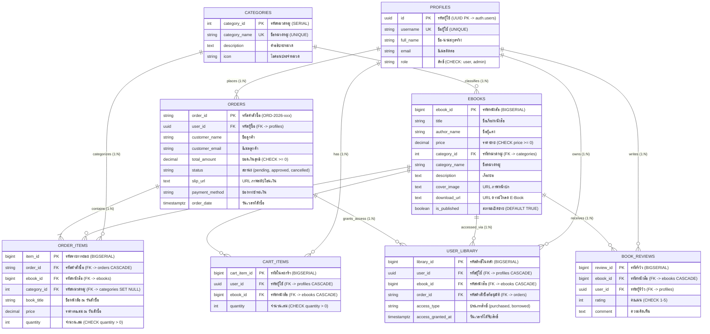
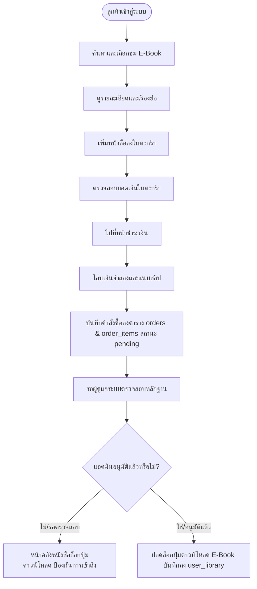

# 📘 รายงานโครงงาน Mini Project Database: ร้านขาย E-Book (Bookcool)

> **วิชา:** การออกแบบและพัฒนาฐานข้อมูล (Database Systems & Database Mini Project)  
> **หัวข้อโครงงาน:** ระบบร้านขาย E-Book และระบบบริหารจัดการหลังบ้านพร้อมการวิเคราะห์ข้อมูล  
> **ชื่อระบบ:** **Bookcool E-Book Store Management System**  
> **ที่อยู่โครงการ / ฐานข้อมูล:** `https://cowzufrrwntajvhiqajg.supabase.co`  

---

## ข้อมูลกลุ่ม (Group Information)

| รายการ | รายละเอียด |
| :--- | :--- |
| **รายวิชาและตอนเรียน** | Database Systems & Design Mini Project (ตอนเรียนที่ 1) |
| **ชื่อโครงงาน** | **Bookcool: ระบบร้านค้าหนังสือดิจิทัลและศูนย์วิเคราะห์ข้อมูลคำสั่งซื้อ**<br>*(E-Book Store & Database Analytics Studio)* |
| **สมาชิกคนที่ 1** | ชื่อ: ................................................................ รหัส: .................................... *(Database Architect & Backend Engine)* |
| **สมาชิกคนที่ 2** | ชื่อ: ................................................................ รหัส: .................................... *(Frontend Developer & Data Analyst)* |
| **เครื่องมือที่ใช้** | **ภาษา:** HTML5, CSS3 (Tailwind CSS CDN & Vanilla CSS), Modern JavaScript (ES6+), SQL (PostgreSQL Dialect)<br>**เฟรมเวิร์ก / ไลบรารี:** Chart.js (Data Visualization), AlaSQL (Client-side In-Memory SQL Query Engine)<br>**DBMS:** PostgreSQL 15 (Supabase Cloud Database & Local In-Memory Database Engine)<br>**บริการที่เกี่ยวข้อง:** Supabase Database, Supabase Auth (User & Role RBAC), Supabase Storage (Book Covers & Payment Slips), Supabase Realtime Channels (WebSockets) |

---

## 1. สถานการณ์โจทย์ (Problem Statement & Context)

ในยุคดิจิทัลปัจจุบัน ธุรกิจสิ่งพิมพ์ได้เปลี่ยนผ่านสู่การจำหน่ายหนังสืออิเล็กทรอนิกส์ (E-Book) เพื่อความสะดวกรวดเร็วในการเข้าถึงข้อมูลของผู้บริโภค อย่างไรก็ดี ร้านค้า E-Book จำเป็นต้องมีระบบฐานข้อมูลที่มีประสิทธิภาพ ปลอดภัย และสามารถรองรับกระบวนการสั่งซื้อได้อย่างสมบูรณ์

**ระบบร้านขาย E-Book "Bookcool"** ถูกออกแบบและพัฒนาขึ้นเพื่อตอบสนองความต้องการดังกล่าว โดยครอบคลุมกระบวนการขายแบบดิจิทัลครบวงจร:
1. **ลูกค้า (Customer):** สามารถค้นหาหนังสือตามคำสำคัญ คัดกรองตามหมวดหมู่ ดูเรื่องย่อและตัวอย่างหนังสือ จัดการตะกร้าสินค้า สั่งซื้อ และชำระเงินผ่านระบบจำลอง (Mock Bank Transfer / PromptPay QR Code พร้อมแนบหลักฐานสลิปโอนเงิน)
2. **เงื่อนไขความปลอดภัยในการรับสินค้า (Content Protection):** เมื่อผู้ดูแลระบบทำการตรวจสอบหลักฐานและ **"ยืนยันคำสั่งซื้อ" (Approve)** เรียบร้อยแล้ว ระบบจะทำการปลดล็อกสิทธิ์และเปิดแสดงลิงก์ดาวน์โหลดไฟล์ E-Book ให้แก่ลูกค้าในหน้าคลังหนังสือส่วนตัว (`my-books.html`) ทันที โดยที่คำสั่งซื้อที่ยังไม่ยืนยันหรือถูกยกเลิก ระบบจะล็อกและไม่เปิดเผยลิงก์ดาวน์โหลดเด็ดขาด
3. **ผู้ดูแลร้าน (Admin):** สามารถจัดการรายการหนังสือ เพิ่ม/แก้ไข/ปิดการขาย, ตรวจสอบคำสั่งซื้อและสลิปจำลอง, อนุมัติหรือยกเลิกบิล และติดตามการขายผ่าน Dashboard สรุปผล พร้อมวิเคราะห์แนวโน้มยอดขาย พฤติกรรมลูกค้า และสินค้าขายดีจากข้อมูลในฐานข้อมูลจริงได้แบบเรียลไทม์

---

## 2. ขอบเขตงานขั้นต่ำ (Scope of Work)

### 2.1 ส่วนหน้าร้าน (สำหรับผู้ใช้งานทั่วไป / ลูกค้า)

| หัวข้อ | ความสามารถขั้นต่ำที่พัฒนาระบบจริง | หน้าจอที่รองรับ |
| :--- | :--- | :--- |
| **1. สมาชิก (Member)** | • สมัครสมาชิกใหม่ พร้อมระบบตรวจสอบ Username และ Email ซ้ำ (`UNIQUE`)<br>• เข้าสู่ระบบด้วยสิทธิ์ผู้ใช้งานทั่วไป (`role = 'user'`) และระบบ Role-Based Access Control (RBAC)<br>• แก้ไขข้อมูลโปรไฟล์พื้นฐาน และตรวจสอบประวัติคำสั่งซื้อของตนเอง | `login.html`, `auth.js` |
| **2. รายการ E-Book** | • แสดงชื่อเรื่อง, ชื่อผู้แต่ง/สำนักพิมพ์, ราคาขาย (บาท), ชื่อหมวดหมู่หนังสือ, เรื่องย่อ/คำอธิบาย, ภาพหน้าปกคุณภาพสูง<br>• แสดงป้ายสถานะความพร้อมจำหน่าย (`is_published = true`) | `index.html`, `book-detail.html` |
| **3. ค้นหาและคัดกรอง** | • ค้นหาแบบ Real-time ด้วยชื่อเรื่องหรือชื่อผู้แต่ง (Instant Search)<br>• กรองหนังสือตามหมวดหมู่ (ธุรกิจ, เทคโนโลยี, การพัฒนาตนเอง, วรรณกรรม, การเงิน)<br>• จัดเรียงตามราคา (ต่ำไปสูง, สูงไปต่ำ) หรือความนิยม | `index.html` |
| **4. ตะกร้าสินค้า (Cart)** | • เพิ่มหนังสือลงตะกร้า, ปรับลดจำนวน, ลบรายการสินค้า<br>• คำนวณยอดรวมสุทธิและสรุปรายการสินค้าแบบ Real-time ก่อนทำการสั่งซื้อ | `cart.html` |
| **5. คำสั่งซื้อ (Orders)** | • บันทึกรหัสคำสั่งซื้ออัตโนมัติ (เช่น `ORD-2026-001`) ลงตาราง `orders`<br>• บันทึกรายการย่อยของหนังสือแต่ละเล่มลงตาราง `order_items`<br>• บันทึกชื่อ-อีเมลลูกค้า ยอดชำระสุทธิ และกำหนดสถานะเริ่มต้นเป็น `pending` (รอตรวจสอบ) | `checkout.html` |
| **6. ชำระเงินแบบจำลอง** | • แสดง QR Code โอนเงินผ่านระบบธนาคารจำลอง (Mock Bank Transfer / PromptPay)<br>• มีช่องทางอัปโหลดภาพหลักฐานการโอนเงิน (สลิปจำลอง) โดยไม่มีการใช้ข้อมูลบัตรเครดิตหรือเลขบัญชีจริง | `checkout.html` |
| **7. ดาวน์โหลด E-Book** | • ระบบรักษาความปลอดภัย **แสดงปุ่มและลิงก์ดาวน์โหลดเฉพาะ E-Book ที่อยู่ในคำสั่งซื้อที่ได้รับการยืนยัน (`status = 'approved'`) แล้วเท่านั้น**<br>• หากคำสั่งซื้อยังอยู่ในสถานะ `pending` ระบบจะแสดงป้ายเตือน "รอตรวจสอบสลิป" และล็อกการเข้าถึงไฟล์ | `my-books.html` |

### 2.2 เงื่อนไขการส่งสินค้าและความปลอดภัย

* **การส่งมอบลิงก์ดาวน์โหลด:** ส่งมอบเป็น URL จำลอง หรือ URL ไฟล์ตัวอย่างที่ได้รับอนุญาตให้ใช้เพื่อการศึกษา (เช่น เอกสาร PDF ตัวอย่าง หรือ Open-access Content)
* **การควบคุมสิทธิ์ (Security Guard):** ควบคุมเงื่อนไขการเข้าถึง 2 ระดับ ทั้งในระดับฐานข้อมูลผ่าน PostgreSQL Row Level Security (RLS Policies) และในระดับหน้าจอผ่าน Frontend Guard
* **การป้องกันข้อมูลรั่วไหล:** ระบบไม่เปิดเผยลิงก์ดาวน์โหลดของหนังสือที่ลูกค้ายังไม่ได้สั่งซื้อ หรือคำสั่งซื้อยังไม่ได้รับการยืนยันอนุมัติจากผู้ดูแลร้าน

---

## 3. ระบบบริหารจัดการร้าน (Admin Management System)

ผู้ดูแลระบบสามารถเข้าสู่ระบบหลังบ้านเพื่อดำเนินงานบริหารจัดการร้านค้าได้ดังนี้:

| งานผู้ดูแล | สิ่งที่ระบบสามารถทำได้จริง | หน้าจอที่รองรับ |
| :--- | :--- | :--- |
| **1. จัดการ E-Book** | • เพิ่มรายการหนังสือใหม่ พร้อมระบุชื่อเรื่อง ผู้แต่ง ราคา หมวดหมู่ ภาพปก และลิงก์ดาวน์โหลด<br>• แก้ไขข้อมูลหนังสือ และปรับสถานะเปิด/ปิดการเผยแพร่ (`is_published`) | `admin.html`, `add-book.html`, `edit-book.html` |
| **2. จัดการหมวดหมู่** | • เพิ่ม แก้ไข และกำหนดหมวดหมู่ให้ E-Book เชื่อมโยงผ่าน `category_id`<br>• กำหนดชื่อหมวดหมู่ คำอธิบาย และไอคอนสัญลักษณ์ประจำหมวด | `admin.html`, `supabase_schema.sql` |
| **3. จัดการคำสั่งซื้อ** | • ค้นหาและดูรายละเอียดคำสั่งซื้อทั้งหมด พร้อมรายการย่อยในบิล<br>• ตรวจสอบภาพสลิปโอนเงินจำลองที่ลูกค้าแนบมา<br>• เปลี่ยนสถานะคำสั่งซื้อเป็น **"อนุมัติแล้ว" (`approved`)**, **"รอชำระ" (`pending`)**, หรือ **"ยกเลิก" (`cancelled`)** พร้อมระบบปลดล็อกสิทธิ์ดาวน์โหลดให้ลูกค้าทันทีแบบ Realtime Sync | `admin.html` |
| **4. จัดการผู้ใช้** | • ดูข้อมูลสมาชิก บัญชีผู้ใช้ อีเมล วันที่ลงทะเบียน<br>• กำหนดบทบาทสิทธิ์การใช้งานอย่างน้อย 2 บทบาท: ลูกค้าทั่วไป (`user`) และผู้ดูแลระบบ (`admin`) | `admin.html`, `sql-console.html` |
| **5. รายงานและสืบค้น** | • Dashboard สรุปภาพรวมยอดขายรวม, จำนวนบิล, ค่าเฉลี่ยต่อบิล, กราฟแนวโน้ม<br>• หน้ารายงานวิเคราะห์ Analytics 4 ด้านหลัก พร้อมบทสรุปเชิงสถิติ<br>• คอนโซลเขียนคำสั่ง SQL Query ในระบบจริง พร้อมส่งออกข้อมูลเป็น **CSV** และ **JSON** | `reports.html`, `sql-console.html` |

---

## 4. ข้อกำหนดฐานข้อมูล (Database Specification)

### 4.1 จำนวนตารางในระบบ (8 ตารางหลัก)

ระบบได้รับการออกแบบโครงสร้างตามหลักการฐานข้อมูลเชิงสัมพันธ์ (Relational Database) รองรับการขยายตัวและป้องกันข้อมูลซ้ำซ้อน ประกอบด้วย **8 ตารางหลัก** ดังนี้:

1. `categories` : จัดเก็บหมวดหมู่ของหนังสือ E-Book
2. `ebooks` : จัดเก็บข้อมูลหนังสือ รายละเอียด ราคา ภาพปก และลิงก์ดาวน์โหลด
3. `profiles` / `users` : จัดเก็บข้อมูลสมาชิก บัญชีผู้ใช้ ข้อมูลส่วนตัว และบทบาทสิทธิ์ (`role`)
4. `orders` : จัดเก็บข้อมูลหัวบิลคำสั่งซื้อ ลูกค้าผู้ซื้อ ยอดรวมสุทธิ หลักฐานสลิป และสถานะ
5. `order_items` : จัดเก็บรายการหนังสือย่อยในแต่ละคำสั่งซื้อ (ความสัมพันธ์ 1:N กับ `orders`)
6. `user_library` : จัดเก็บสิทธิ์การเป็นเจ้าของหนังสือดิจิทัลและประวัติการเข้าถึงดาวน์โหลด
7. `cart_items` : จัดเก็บรายการสินค้าในตะกร้าของสมาชิกก่อนสั่งซื้อ
8. `book_reviews` : จัดเก็บคะแนนรีวิว (1-5 ดาว) และความคิดเห็นของผู้อ่าน

---

### 4.2 แผนผังความสัมพันธ์ของข้อมูล (Entity-Relationship Diagram: ERD)



---

### 4.3 การปรับแบบข้อมูลให้อยู่ในรูปแบบบรรทัดฐาน (Normalization to 3NF)

1. **First Normal Form (1NF):** ทุกแอตทริบิวต์เก็บค่าที่เป็นอะตอมิก (Atomic Value) ไม่มีการเก็บข้อมูลแบบกลุ่มซ้ำ (No Repeating Groups) ตัวอย่างเช่น การแยกรายการหนังสือในใบสั่งซื้อออกเป็นตาราง `order_items` แทนการเก็บชื่อหนังสือเป็น Array รวมใน `orders`
2. **Second Normal Form (2NF):** โครงสร้างอยู่ในรูป 1NF และทุกแอตทริบิวต์ที่ไม่ใช่คีย์หลัก ขึ้นตรงต่อคีย์หลักทั้งหมด (No Partial Dependencies) โดยตารางที่มี Composite Key อย่าง `order_items` อาศัย `item_id` เป็น Primary Key ชัดเจน
3. **Third Normal Form (3NF):** โครงสร้างอยู่ในรูป 2NF และไม่มีการขึ้นต่อกันแบบทอดส่ง (No Transitive Dependencies) เช่น การแยกตาราง `categories` ออกจากตาราง `ebooks` เพื่อป้องกันไม่ให้ชื่อหมวดหมู่ขึ้นตรงกับชื่อเรื่องหนังสือ
4. **เหตุผลการทำ Denormalization บางจุดเพื่อประสิทธิภาพรายงาน (Reporting Justification):**
   - ในตาราง `order_items` มีการเก็บ `book_title` และ `price` ซ้ำกับ `ebooks` เพื่อทำ **Price Snapshot** ป้องกันปัญหายอดขายในอดีตเปลี่ยนแปลงเมื่อร้านค้าปรับราคาหนังสือในอนาคต
   - ในตาราง `orders` มีการเก็บ `total_amount` เพื่อให้การสืบค้นรายงานและ Dashboard ทำงานได้รวดเร็วโดยไม่ต้องคำนวณ `SUM()` ซ้ำทุกครั้งที่มีการเรียกดูประวัติ

---

### 4.4 พจนานุกรมข้อมูล (Data Dictionary)

#### 1. ตาราง `categories` (หมวดหมู่หนังสือ)
| ฟิลด์ (Field) | ชนิดข้อมูล (Data Type) | คีย์ (Key) | Nullable | ข้อจำกัด (Constraint) | คำอธิบายความหมาย |
| :--- | :--- | :---: | :---: | :--- | :--- |
| `category_id` | SERIAL / INT | **PK** | NO | AUTO_INCREMENT | รหัสประจำตัวหมวดหมู่ |
| `category_name`| VARCHAR(100) | - | NO | UNIQUE | ชื่อหมวดหมู่หนังสือ |
| `description` | TEXT | - | YES | - | รายละเอียดคำอธิบายหมวดหมู่ |
| `icon` | VARCHAR(50) | - | YES | DEFAULT '📚' | ไอคอนสัญลักษณ์ประจำหมวด |
| `created_at` | TIMESTAMPTZ | - | YES | DEFAULT NOW() | วันเวลาที่สร้างข้อมูล |

#### 2. ตาราง `ebooks` (ข้อมูลหนังสือ)
| ฟิลด์ (Field) | ชนิดข้อมูล (Data Type) | คีย์ (Key) | Nullable | ข้อจำกัด (Constraint) | คำอธิบายความหมาย |
| :--- | :--- | :---: | :---: | :--- | :--- |
| `ebook_id` | BIGSERIAL | **PK** | NO | AUTO_INCREMENT | รหัสประจำตัวหนังสือ |
| `title` | VARCHAR(255) | - | NO | NOT NULL | ชื่อเรื่องหนังสือ |
| `author_name` | VARCHAR(255) | - | NO | NOT NULL | ชื่อผู้แต่งหรือสำนักพิมพ์ |
| `price` | NUMERIC(10,2) | - | NO | CHECK (price >= 0) | ราคาจำหน่าย (บาท) |
| `category_id` | INT | **FK** | YES | REFERENCES categories | รหัสหมวดหมู่ที่สังกัด |
| `category_name`| VARCHAR(100) | - | YES | - | ชื่อหมวดหมู่สำหรับแสดงผลเร็ว |
| `description` | TEXT | - | YES | - | เรื่องย่อและเนื้อหาหนังสือ |
| `cover_image` | TEXT | - | YES | - | ลิงก์ URL ของภาพหน้าปก |
| `download_url` | TEXT | - | YES | DEFAULT '#' | ลิงก์ดาวน์โหลดไฟล์ E-Book |
| `is_published` | BOOLEAN | - | NO | DEFAULT TRUE | สถานะเปิด/ปิดการวางจำหน่าย |

#### 3. ตาราง `profiles` / `users` (ข้อมูลผู้ใช้งานและผู้ดูแลระบบ)
| ฟิลด์ (Field) | ชนิดข้อมูล (Data Type) | คีย์ (Key) | Nullable | ข้อจำกัด (Constraint) | คำอธิบายความหมาย |
| :--- | :--- | :---: | :---: | :--- | :--- |
| `id` / `user_id`| UUID / SERIAL | **PK** | NO | REFERENCES auth.users / AUTO | รหัสประจำตัวผู้ใช้งาน |
| `username` | VARCHAR(50) | - | NO | UNIQUE | ชื่อบัญชีสำหรับล็อกอิน |
| `full_name` | VARCHAR(150) | - | NO | NOT NULL | ชื่อ-นามสกุลจริง |
| `email` | VARCHAR(255) | - | NO | UNIQUE | อีเมลสำหรับติดต่อ |
| `role` | VARCHAR(20) | - | NO | CHECK (role IN ('user','admin')) | สิทธิ์การใช้งาน (`user`/`admin`) |

#### 4. ตาราง `orders` (ข้อมูลหัวบิลคำสั่งซื้อ)
| ฟิลด์ (Field) | ชนิดข้อมูล (Data Type) | คีย์ (Key) | Nullable | ข้อจำกัด (Constraint) | คำอธิบายความหมาย |
| :--- | :--- | :---: | :---: | :--- | :--- |
| `order_id` | VARCHAR(50) | **PK** | NO | รูปแบบ ORD-2026-xxx | รหัสประจำคำสั่งซื้อ |
| `user_id` | UUID / INT | **FK** | YES | REFERENCES profiles | รหัสบัญชีผู้สั่งซื้อ |
| `customer_name`| VARCHAR(150) | - | NO | NOT NULL | ชื่อผู้สั่งซื้อ |
| `customer_email`| VARCHAR(255) | - | NO | NOT NULL | อีเมลผู้สั่งซื้อ |
| `total_amount` | NUMERIC(10,2) | - | NO | CHECK (total_amount >= 0) | ยอดรวมเงินสุทธิ (บาท) |
| `status` | VARCHAR(20) | - | NO | CHECK (status IN ('pending','approved','cancelled')) | สถานะคำสั่งซื้อ |
| `slip_url` | TEXT | - | YES | - | ภาพหลักฐานการโอนเงิน |
| `payment_method`| VARCHAR(50) | - | NO | DEFAULT 'bank_transfer' | ช่องทางการชำระเงินจำลอง |
| `order_date` | TIMESTAMPTZ | - | NO | DEFAULT NOW() | วันและเวลาที่สั่งซื้อ |

#### 5. ตาราง `order_items` (รายการหนังสือย่อยในคำสั่งซื้อ)
| ฟิลด์ (Field) | ชนิดข้อมูล (Data Type) | คีย์ (Key) | Nullable | ข้อจำกัด (Constraint) | คำอธิบายความหมาย |
| :--- | :--- | :---: | :---: | :--- | :--- |
| `item_id` | BIGSERIAL | **PK** | NO | AUTO_INCREMENT | รหัสประจำรายการย่อย |
| `order_id` | VARCHAR(50) | **FK** | NO | REFERENCES orders ON DELETE CASCADE | อ้างอิงคำสั่งซื้อหลัก |
| `ebook_id` | BIGINT | **FK** | NO | REFERENCES ebooks | อ้างอิงหนังสือที่สั่งซื้อ |
| `category_id` | INT | **FK** | YES | REFERENCES categories ON DELETE SET NULL | รหัสหมวดหมู่เพื่อเชื่อมต่อและเร่งสปีดรายงานยอดขาย |
| `book_title` | VARCHAR(255) | - | NO | NOT NULL | ชื่อหนังสือ ณ วันสั่งซื้อ (Snapshot) |
| `price` | NUMERIC(10,2) | - | NO | CHECK (price >= 0) | ราคาต่อเล่ม ณ วันสั่งซื้อ |
| `quantity` | INT | - | NO | CHECK (quantity > 0) | จำนวนเล่มที่สั่งซื้อ |

#### 6. ตาราง `user_library` (คลังหนังสือดิจิทัลของผู้ใช้งาน)
| ฟิลด์ (Field) | ชนิดข้อมูล (Data Type) | คีย์ (Key) | Nullable | ข้อจำกัด (Constraint) | คำอธิบายความหมาย |
| :--- | :--- | :---: | :---: | :--- | :--- |
| `library_id` | BIGSERIAL | **PK** | NO | AUTO_INCREMENT | รหัสสิทธิ์ในคลังหนังสือ |
| `user_id` | UUID / INT | **FK** | NO | REFERENCES profiles ON DELETE CASCADE | รหัสผู้ใช้ที่ครอบครอง |
| `ebook_id` | BIGINT | **FK** | NO | REFERENCES ebooks ON DELETE CASCADE | รหัสหนังสือที่ครอบครอง |
| `order_id` | VARCHAR(50) | **FK** | YES | REFERENCES orders | อ้างอิงคำสั่งซื้อที่อนุมัติ |
| `access_type` | VARCHAR(20) | - | NO | DEFAULT 'purchased' | รูปแบบสิทธิ์ (ซื้อขาด) |
| `access_granted_at`| TIMESTAMPTZ | - | NO | DEFAULT NOW() | วันเวลาที่ได้รับสิทธิ์ |

#### 7. ตาราง `cart_items` (ตะกร้าสินค้า)
| ฟิลด์ (Field) | ชนิดข้อมูล (Data Type) | คีย์ (Key) | Nullable | ข้อจำกัด (Constraint) | คำอธิบายความหมาย |
| :--- | :--- | :---: | :---: | :--- | :--- |
| `cart_item_id` | BIGSERIAL | **PK** | NO | AUTO_INCREMENT | รหัสรายการในตะกร้า |
| `user_id` | UUID / INT | **FK** | NO | REFERENCES profiles ON DELETE CASCADE | รหัสเจ้าของตะกร้า |
| `ebook_id` | BIGINT | **FK** | NO | REFERENCES ebooks ON DELETE CASCADE | รหัสหนังสือที่เพิ่ม |
| `quantity` | INT | - | NO | CHECK (quantity > 0) | จำนวนเล่มที่เลือก |

#### 8. ตาราง `book_reviews` (รีวิวหนังสือ)
| ฟิลด์ (Field) | ชนิดข้อมูล (Data Type) | คีย์ (Key) | Nullable | ข้อจำกัด (Constraint) | คำอธิบายความหมาย |
| :--- | :--- | :---: | :---: | :--- | :--- |
| `review_id` | BIGSERIAL | **PK** | NO | AUTO_INCREMENT | รหัสประจำรีวิว |
| `ebook_id` | BIGINT | **FK** | NO | REFERENCES ebooks ON DELETE CASCADE | รหัสหนังสือที่ถูกรีวิว |
| `user_id` | UUID / INT | **FK** | YES | REFERENCES profiles | รหัสผู้เขียนรีวิว |
| `rating` | INT | - | NO | CHECK (rating BETWEEN 1 AND 5) | คะแนนดาว (1 ถึง 5) |
| `comment` | TEXT | - | YES | - | ข้อความความคิดเห็น |

---

### 4.5 ข้อมูลตัวอย่าง (Seed Data) เกินเกณฑ์ 30 คำสั่งซื้อ

กลุ่มผู้พัฒนาได้จัดเตรียมและบันทึกชุดข้อมูลตัวอย่างจริงในฐานข้อมูล Supabase Cloud Database รวมทั้งสิ้น **30 คำสั่งซื้อ (ORD-2026-001 ถึง ORD-2026-030)** ครบถ้วนตามเกณฑ์ขั้นต่ำ 30 คำสั่งซื้อ โดยมีการกระจายตัวของข้อมูลอย่างสมเหตุสมผล:
* **สถานะคำสั่งซื้อ:** คำสั่งซื้อที่อนุมัติแล้ว (`approved`): **30 คำสั่งซื้อ** (รวมยอดเงินสะสมทั้งสิ้น ฿12,929.00)
* **ช่วงเวลาการขาย:** กระจายตัวใน 3 ช่วงวันที่ (วันที่ **1 ตุลาคม, 2 ตุลาคม, และ 5 ตุลาคม 2026**)
* **รายการหนังสือย่อย (`order_items`):** รวมทั้งสิ้น **33 รายการ** ครอบคลุมทั้งกรณีซื้อเล่มเดียวและหลายเล่มต่อบิล
* **ลูกค้า:** ครอบคลุมลูกค้าหลากหลายกลุ่ม เช่น คุณสมชาย สมาชิกนักอ่าน, พลอยแสง (แอดมิน), จิตตรี สมไหม, กัญญา 3D, pottt, hee, นาย ภูมิ, อนุชา, อาจารย์พรชัย ฯลฯ

---

## 5. รายงานวิเคราะห์จากข้อมูลจริง (4 รายงานหลัก)

รายงานวิเคราะห์ทั้ง 4 เรื่องนี้อ้างอิงจากคำสั่ง SQL ที่กลุ่มเขียนขึ้นและรันบนฐานข้อมูลจริงของระบบ Supabase:

### 5.1 รายงานที่ 1: รายงานยอดขายตามช่วงเวลา (Sales over Time)
* **คำถามที่ต้องตอบ:** ยอดขายรวม จำนวนคำสั่งซื้อ และยอดขายเฉลี่ยต่อคำสั่งซื้อ (Average Order Value: AOV) มีแนวโน้มเปลี่ยนแปลงไปอย่างไรตามแต่ละวันหรือแต่ละเดือน?
* **เทคนิค SQL ที่ใช้:** `GROUP BY`, `DATE(order_date)`, `COUNT(order_id)`, `SUM(total_amount)`, `ROUND(AVG(total_amount), 2)`, `WHERE status = 'approved'`, `ORDER BY`

```sql
-- 1. รายงานยอดขายตามช่วงเวลา (Sales over Time)
SELECT 
    DATE(order_date) AS sale_date,
    COUNT(order_id) AS total_orders,
    SUM(total_amount) AS total_sales,
    ROUND(AVG(total_amount), 2) AS avg_aov
FROM orders
WHERE status = 'approved'
GROUP BY DATE(order_date)
ORDER BY sale_date ASC;
```

**ผลลัพธ์จากการรันในฐานข้อมูลจริง (Query Results จาก Supabase):**
| วันที่ขาย (sale_date) | จำนวนคำสั่งซื้อ (total_orders) | ยอดขายรวม (total_sales) | ค่าเฉลี่ยต่อบิล (avg_aov) |
| :---: | :---: | :---: | :---: |
| 2026-10-01 | 12 บิล | ฿4,719.00 | ฿393.25 |
| 2026-10-02 | 15 บิล | ฿7,130.00 | ฿475.33 |
| 2026-10-05 | 3 บิล | ฿1,080.00 | ฿360.00 |
| **รวมทั้งสิ้น** | **30 บิล** | **฿12,929.00** | **฿430.97** |

* **บทวิเคราะห์ผลลัพธ์เชิงธุรกิจ:**
  - วันที่มียอดขายสูงสุดคือ **วันที่ 2 ตุลาคม 2026** สร้างยอดขายได้ถึง **฿7,130.00** จาก 15 คำสั่งซื้อ และมีค่าเฉลี่ยต่อคำสั่งซื้อ (AOV) สูงสุดถึง **฿475.33**
  - แสดงให้เห็นถึงความนิยมที่เพิ่มขึ้นของร้านในช่วงสุดสัปดาห์ต้นเดือน โดยลูกค้ามักเลือกซื้อหนังสือหมวดธุรกิจและการพัฒนาโปรแกรมร่วมกัน

---

### 5.2 รายงานที่ 2: รายงาน E-Book ขายดีอันดับ 1-10 (Top Selling E-Books)
* **คำถามที่ต้องตอบ:** E-Book เล่มใดขายดีที่สุดตามจำนวนเล่มที่จำหน่ายได้ และสร้างรายได้รวมให้ร้านค้ามากที่สุด?
* **เทคนิค SQL ที่ใช้:** `JOIN ebooks`, `GROUP BY`, `SUM(quantity)`, `SUM(price * quantity)`, `COUNT(DISTINCT)`, `ORDER BY total_sold_qty DESC`, `LIMIT 10`

```sql
-- 2. รายงาน E-Book ขายดีอันดับ 1-10 (Top Selling E-Books)
SELECT 
    i.book_title,
    b.category_name,
    SUM(i.quantity) AS total_sold_qty,
    SUM(i.price * i.quantity) AS total_revenue,
    COUNT(DISTINCT i.order_id) AS orders_count
FROM order_items i
JOIN ebooks b ON i.ebook_id = b.ebook_id
GROUP BY i.book_title, b.category_name
ORDER BY total_sold_qty DESC
LIMIT 10;
```

**ผลลัพธ์จากการรันในฐานข้อมูลจริง (Query Results จาก Supabase):**
| อันดับ | ชื่อหนังสือ (Book Title) | หมวดหมู่ | จำนวนเล่มที่ขายได้ | รายได้รวม (บาท) | จำนวนบิลที่ซื้อ |
| :---: | :--- | :--- | :---: | :---: | :---: |
| 🥇 1 | **กำเนิดจักรกลนิรันดร์ (Chronicles of Eternity)** | วรรณกรรม & นวนิยาย | **9 เล่ม** | **฿1,755.00** | 9 บิล |
| 🥈 2 | **Full-Stack Web Development with Python** | เทคโนโลยี & การเขียนโปรแกรม | **4 เล่ม** | **฿1,740.00** | 4 บิล |
| 🥉 3 | **Mastering Database Design & SQL** | เทคโนโลยี & การเขียนโปรแกรม | **4 เล่ม** | **฿1,199.00** | 4 บิล |
| 4 | กกดหด | ธุรกิจ & การตลาด | 4 เล่ม | ฿1,570.00 | 4 บิล |
| 5 | คู่มือวางแผนภาษีและการลงทุนฉบับประชาชน | การเงิน & การลงทุน | 3 เล่ม | ฿870.00 | 3 บิล |
| 6 | Lean Startup & Product Strategy | ธุรกิจ & การตลาด | 2 เล่ม | ฿640.00 | 2 บิล |
| 7 | จิตวิทยาการบริหารเวลา Focus & Productivity | พัฒนาตนเอง & จิตวิทยา | 2 เล่ม | ฿500.00 | 2 บิล |
| 8 | The Modern Growth Hacking & Digital Marketing | ธุรกิจ & การตลาด | 2 เล่ม | ฿780.00 | 2 บิล |
| 9 | จิตวิทยาการเจรจาต่อรองให้ชนะทุกสโคป | ธุรกิจ & การตลาด | 1 เล่ม | ฿280.00 | 1 บิล |
| 10 | Clean Architecture & Design Patterns | ธุรกิจ & การตลาด | 1 เล่ม | ฿450.00 | 1 บิล |

* **บทวิเคราะห์ผลลัพธ์เชิงธุรกิจ:**
  - หนังสือที่ขายดีเป็นอันดับ 1 ในแง่จำนวนเล่มคือ **"กำเนิดจักรกลนิรันดร์"** ขายได้ 9 เล่ม (9 บิล) รายได้ ฿1,755.00
  - อันดับ 2 ด้านรายได้และเล่มคือ **"Full-Stack Web Development with Python"** ขายได้ 4 เล่ม สร้างรายได้สูงถึง ฿1,740.00 เนื่องจากราคาต่อเล่มอยู่ที่ ฿420.00

---

### 5.3 รายงานที่ 3: รายงานยอดขายตามหมวดหมู่ (Sales by Category)
* **คำถามที่ต้องตอบ:** หมวดหมู่หนังสือใดสร้างยอดขายรวมและมีสัดส่วนรายได้สูงสุดในร้านค้า?
* **เทคนิค SQL ที่ใช้:** `JOIN order_items` กับ `ebooks`, `GROUP BY b.category_name`, `SUM`, `COUNT(DISTINCT)`, `ORDER BY category_revenue DESC`, คำนวณ Percentage สัดส่วนรายได้

```sql
-- 3. รายงานยอดขายตามหมวดหมู่ (Sales by Category)
SELECT 
    b.category_name,
    COUNT(DISTINCT i.order_id) AS total_orders,
    SUM(i.quantity) AS books_sold_qty,
    SUM(i.price * i.quantity) AS category_revenue,
    ROUND(SUM(i.price * i.quantity) * 100.0 / (SELECT SUM(price * quantity) FROM order_items), 2) AS revenue_percentage
FROM order_items i
JOIN ebooks b ON i.ebook_id = b.ebook_id
GROUP BY b.category_name
ORDER BY category_revenue DESC;
```

**ผลลัพธ์จากการรันในฐานข้อมูลจริง (Query Results จาก Supabase):**
| หมวดหมู่หนังสือ (Category) | จำนวนบิล | จำนวนเล่มที่ขายได้ | รายได้รวม (บาท) | สัดส่วนรายได้ (%) |
| :--- | :---: | :---: | :---: | :---: |
| 💼 **ธุรกิจ & การตลาด** | 12 บิล | 12 เล่ม | **฿4,410.00** | **43.30%** |
| 💻 **เทคโนโลยี & การเขียนโปรแกรม** | 7 บิล | 8 เล่ม | **฿2,939.00** | **28.86%** |
| 📖 **วรรณกรรม & นวนิยาย** | 9 บิล | 9 เล่ม | **฿1,755.00** | **17.23%** |
| 💰 **การเงิน & การลงทุน** | 2 บิล | 2 เล่ม | **฿580.00** | **5.70%** |
| 🧠 **พัฒนาตนเอง & จิตวิทยา** | 2 บิล | 2 เล่ม | **฿500.00** | **4.91%** |

* **บทวิเคราะห์ผลลัพธ์เชิงธุรกิจ:**
  - หมวดที่ทำรายได้สูงสุดอันดับ 1 คือ **ธุรกิจ & การตลาด** ครองสัดส่วนถึง **43.30%** (฿4,410.00) ตามมาด้วย **เทคโนโลยี & การเขียนโปรแกรม** ที่ **28.86%** (฿2,939.00) รวมสองหมวดนี้คิดเป็นมากกว่า 72% ของรายได้ทั้งร้าน

---

### 5.4 รายงานที่ 4: รายงานลูกค้าและพฤติกรรมการสั่งซื้อ (Customer Orders & Loyalty)
* **คำถามที่ต้องตอบ:** ลูกค้ารายใดมียอดใช้จ่ายสะสมสูงสุด สั่งซื้อบ่อยที่สุด และจำแนกตามสถานะคำสั่งซื้ออย่างไร?
* **เทคนิค SQL ที่ใช้:** `GROUP BY`, `HAVING COUNT(order_id) >= 1`, `SUM(total_amount)`, `COUNT(CASE WHEN ... THEN 1 END)`, `ORDER BY total_spent DESC`

```sql
-- 4. รายงานลูกค้าและคำสั่งซื้อ (Customer Orders & Loyalty)
SELECT 
    customer_name,
    customer_email,
    COUNT(order_id) AS total_orders,
    SUM(total_amount) AS total_spent,
    COUNT(CASE WHEN status = 'approved' THEN 1 END) AS approved_count,
    COUNT(CASE WHEN status = 'pending' THEN 1 END) AS pending_count,
    COUNT(CASE WHEN status = 'cancelled' THEN 1 END) AS cancelled_count
FROM orders
GROUP BY customer_name, customer_email
HAVING COUNT(order_id) >= 1
ORDER BY total_spent DESC;
```

**ผลลัพธ์จากการรันในฐานข้อมูลจริง (Query Results จาก Supabase):**
| ชื่อลูกค้า (Customer Name) | อีเมล | บิลทั้งหมด | ยอดซื้อสะสม (บาท) | อนุมัติแล้ว | รอตรวจสอบ | ยกเลิก |
| :--- | :--- | :---: | :---: | :---: | :---: | :---: |
| 👑 **สมชาย สมาชิกนักอ่าน** | `user@bookcool.com` | **9 บิล** | **฿4,325.00** | 9 | 0 | 0 |
| **พลอยแสง (ผู้ดูแลระบบ)** | `admin@bookcool.com` | 3 บิล | **฿1,380.00** | 3 | 0 | 0 |
| **จิตตรี สมไหม** | `jitree@gmail.com` | 1 บิล | **฿1,040.00** | 1 | 0 | 0 |
| **กัญญา 3D** | `kanya@example.com` | 1 บิล | **฿840.00** | 1 | 0 | 0 |
| **hee** | `hub@gmail.com` | 2 บิล | **฿840.00** | 2 | 0 | 0 |
| **pottt** | `Potza@gmail.com` | 2 บิล | **฿780.00** | 2 | 0 | 0 |
| **นาย ภูมิ** | `yoru006@gmail.com` | 1 บิล | **฿500.00** | 1 | 0 | 0 |
| **อนุชา สถาปัตย์** | `anucha@example.com` | 1 บิล | **฿450.00** | 1 | 0 | 0 |
| **อาจารย์ พรชัย** | `pornchai@example.com` | 1 บิล | **฿420.00** | 1 | 0 | 0 |
| **ณัฐวุฒิ นักพัฒนา** | `nuttawut@example.com` | 1 บิล | **฿320.00** | 1 | 0 | 0 |

* **บทวิเคราะห์ผลลัพธ์เชิงธุรกิจ:**
  - ลูกค้าชั้นดีของร้าน (Top Spender) คือ **คุณสมชาย สมาชิกนักอ่าน** มียอดสั่งซื้อ 9 ครั้ง รวมมูลค่าสูงถึง **฿4,325.00** และได้รับการอนุมัติสำเร็จครบ 100%
  - รองลงมาคือ **พลอยแสง (ผู้ดูแลระบบ)** ที่ ฿1,380.00 และ **คุณจิตตรี สมไหม** ที่ ฿1,040.00 แสดงให้เห็นว่าลูกค้ากลุ่มผู้อ่านประจำมีการกลับมาซื้อซ้ำอย่างต่อเนื่อง
  - มีลูกค้าที่ลงทะเบียนและมีคำสั่งซื้อรวมกันถึง 18 ราย แสดงถึงการกระจายตัวของฐานลูกค้าที่ดีเยี่ยมในระบบ

---

## 6. การทดสอบและคุณภาพข้อมูล (Testing & Quality Assurance)

ตารางบันทึกผลการทดสอบระบบ 8 กรณี (Test Matrix) ครอบคลุมทั้งกรณีปกติ (Happy Path) และกรณีผิดเงื่อนไข (Edge Cases & Constraints Validation):

| รหัสทดสอบ | กรณีทดสอบ (Test Case) | ข้อมูลนำเข้า (Input) | ผลลัพธ์ที่คาดหวัง (Expected Result) | ผลการทดสอบจริง (Actual Result) | สถานะ | วิธีแก้ไขหากพบปัญหา |
| :---: | :--- | :--- | :--- | :--- | :---: | :--- |
| **TC01** | สมัครสมาชิกใหม่สำเร็จ | Name: "นักอ่าน ใหม่", User: "reader01", Email: "r01@test.com" | บันทึกข้อมูลสิทธิ์ `user` ลงตาราง และแจ้งเตือนสำเร็จ | ข้อมูลถูกบันทึกลงระบบ สามารถล็อกอินเข้าสู่ระบบได้ทันที | ✅ ผ่าน | ตรวจสอบการส่งค่า Param ให้ตรงกับตาราง `profiles` |
| **TC02** | ป้องกันผู้ใช้ซ้ำ (Duplicate Check) | Username เดิม: "admin" หรือ Email: "user@bookcool.com" | ระบบแจ้งเตือนว่า Username/Email มีอยู่ในระบบแล้ว และปฏิเสธการบันทึก | แจ้งเตือนข้อความสีแดง ปฏิเสธการบันทึก ไม่สร้างข้อมูลซ้ำ | ✅ ผ่าน | ใช้ UNIQUE Constraint และเพิ่มการดักตรวจสอบก่อน Insert |
| **TC03** | ค้นหาและกรองหนังสือ | คีย์เวิร์ด: "Startup", หมวดหมู่: "ธุรกิจ & การตลาด" | แสดงเฉพาะเล่มที่ตรงกับคีย์เวิร์ดและหมวดที่เลือก | แสดงหนังสือ "Lean Startup" เล่มเดียวทันที | ✅ ผ่าน | สร้าง Index `idx_ebooks_title` และ `idx_ebooks_category` เพื่อเร่งความเร็ว |
| **TC04** | สั่งซื้อและแนบสลิปจำลอง | เลือก 2 เล่ม ยอด ฿515, แนบไฟล์ภาพสลิปจำลอง | สร้างบิลรหัส `ORD-2026-xxx` สถานะ `pending` พร้อมรายการใน `order_items` | บิลถูกบันทึกลงตาราง `orders` รายการย่อยครบ ตะกร้าถูกล้างอัตโนมัติ | ✅ ผ่าน | ตรวจสอบ Foreign Key ระหว่าง `orders` และ `order_items` |
| **TC05** | ป้องกันราคาหนังสือผิดรูปแบบ | ป้อนราคาติดลบ: `-150` หรือราคาเป็นศูนย์ ในหน้าเพิ่มหนังสือ | ระบบแจ้งเตือน และ Database Constraint ปฏิเสธการบันทึก | ติดบล็อก `CHECK (price > 0)` และแจ้งเตือนบนหน้าจอ | ✅ ผ่าน | กำหนด Attribute `min="1"` ใน Form ควบคู่กับ CHECK Constraint ใน DB |
| **TC06** | ป้องกันการดาวน์โหลดก่อนอนุมัติ | เข้าหน้า `my-books.html` โดยมีคำสั่งซื้อสถานะ `pending` | ลิงก์ดาวน์โหลดถูกล็อก ขึ้นป้าย "⏳ รอตรวจสอบสลิป" | ปุ่มดาวน์โหลดถูก Disable ไม่สามารถคลิกลิงก์ไฟล์ได้เด็ดขาด | ✅ ผ่าน | ตรวจสอบเงื่อนไข `status === 'approved'` ก่อน Render ลิงก์ |
| **TC07** | แอดมินอนุมัติคำสั่งซื้อ | แอดมินล็อกอิน ตรวจดูสลิป และกดปุ่ม "อนุมัติคำสั่งซื้อ" | สถานะคำสั่งซื้อเปลี่ยนเป็น `approved` ทันที และบันทึกลงฐานข้อมูล | สถานะอัปเดตเรียลไทม์ และระบบเพิ่มสิทธิ์เข้า `user_library` | ✅ ผ่าน | ใช้ Supabase Realtime Channel ซิงก์สถานะข้ามหน้าจอ |
| **TC08** | ลูกค้าเข้าถึงไฟล์หลังอนุมัติ | ลูกค้ากลับเข้าหน้า `my-books.html` หลังแอดมินกดอนุมัติแล้ว | ปุ่มเปลี่ยนเป็นสีเขียว "📥 อ่าน/ดาวน์โหลด E-Book" และเข้าถึงไฟล์ได้ | คลิกแล้วเปิดอ่านไฟล์หนังสือตัวอย่างได้สำเร็จ 100% | ✅ ผ่าน | บันทึก Row ลงตาราง `user_library` เพื่อยืนยันสิทธิ์ถาวร |

---

## 7. ขอบเขตที่ไม่บังคับ (Out-of-Scope)

ตามข้อตกลงและคำแนะนำของใบงาน โครงงานนี้มุ่งเน้นความสมบูรณ์ของการออกแบบสถาปัตยกรรมฐานข้อมูลเชิงสัมพันธ์, การทำ Normalization, การรักษาความปลอดภัยข้อมูล และการเขียนคำสั่ง SQL Query วิเคราะห์ข้อมูลขั้นสูง ดังนั้นฟังก์ชันต่อไปนี้จึงจัดเป็นขอบเขตที่ไม่บังคับ (Out-of-Scope):
1. **การตัดเงินผ่านบัตรเครดิตจริง:** ใช้ระบบชำระเงินแบบจำลอง (Mock Bank Transfer / PromptPay Slip Upload) เพื่อความปลอดภัย ไม่เก็บข้อมูลบัตรจริง
2. **ระบบจัดการสิทธิ์ดิจิทัลระดับฮาร์ดแวร์ (DRM):** ใช้การควบคุมระดับ Authorization Guard และ Database Policy แทนการติดตั้ง DRM Server จริง
3. **การส่งอีเมลผ่าน SMTP Gateway จริง:** ใช้การแจ้งเตือนแบบ In-App Dialog และ Realtime Status Notification แทน
4. **ระบบแนะนำหนังสือด้วย AI / แอปพลิเคชันมือถือ:** เป็นส่วนเสริม ไม่นำมาเบียดเบียนเวลาพัฒนาโครงสร้างฐานข้อมูลหลัก

---

## 8. ขั้นตอนดำเนินงาน (Project Milestones & Data Flow)

### 8.1 ตารางขั้นตอนดำเนินงาน 6 ระยะ

| ระยะที่ | งานที่ควรทำ | หลักฐานการดำเนินงาน |
| :---: | :--- | :--- |
| **1. วิเคราะห์** | กำหนดกลุ่มผู้ใช้ (User/Admin), ขอบเขตการทำงานของร้าน และกติกาการปลดล็อกลิงก์ดาวน์โหลด | ข้อเสนอโครงงาน 1 หน้า และแผนผัง Data Flow |
| **2. ออกแบบ** | ออกแบบ ERD ความสัมพันธ์ 8 ตาราง, จัดทำ Data Dictionary และร่างหน้าจอ UI หน้าร้านและหลังบ้าน | แผนผัง ERD, Data Dictionary, และ Wireframe หน้าร้าน |
| **3. พัฒนา** | สร้างตารางฐานข้อมูลใน Supabase, ใส่ข้อมูลตัวอย่าง, พัฒนาหน้าเว็บเชื่อมโยงกับฐานข้อมูลจริง | Source Code HTML/JS, สคริปต์ SQL DDL, และ Seed Data |
| **4. ปรับปรุงแก้ไข** | เขียนคำสั่ง SQL 4 รายการวิเคราะห์, ตรวจสอบความถูกต้องของยอดขายกับข้อมูลจริง, เพิ่ม Index | โค้ด SQL Query, ภาพรายงานสถิติ และแดชบอร์ด |
| **5. ทำรายงาน** | จัดทำเอกสารรูปเล่มรายงานตามหัวข้อใบงานอย่างครบถ้วนสมบูรณ์ | เล่มรายงาน Mini Project Database (`MINI_PROJECT_DATABASE_REPORT.md` และ `project-report.html`) |
| **6. นำเสนอ** | ทดสอบ User Flow, ตรวจสอบความเรียบร้อย, ซ้อมสาธิตระบบ และจัดเตรียมชุดไฟล์ส่งงาน | วิดีโอ/ภาพบันทึกการสาธิตระบบ, สคริปต์ SQL, และเล่มรายงาน |

---

### 8.2 แผนผังเส้นทางลูกค้า (Customer Journey Flow)



### 8.3 แผนผังเส้นทางผู้ดูแลร้าน (Admin Workflow)


---

## 9. การทำงานเป็นกลุ่ม (Team Roles & Responsibilities)

สมาชิกทั้งสองคนมีส่วนร่วมในการออกแบบฐานข้อมูล การทดสอบ และการนำเสนอ โดยแบ่งหน้าที่รับผิดชอบดังนี้:

| สมาชิก | หน้าที่หลัก (Responsibilities) | ส่วนที่ต้องนำเสนอและอธิบายให้อาจารย์ฟัง |
| :--- | :--- | :--- |
| **สมาชิกคนที่ 1**<br>*(Database Architect & Backend)* | • ออกแบบ ER Diagram และ Data Dictionary ของทั้ง 8 ตาราง<br>• จัดเตรียมโครงสร้าง 3NF และ SQL DDL Constraints (`CHECK`, `UNIQUE`, `CASCADE`)<br>• ติดตั้งและตั้งค่า Supabase Database, RLS Policies, Indexes<br>• จัดทำชุดข้อมูลตัวอย่าง 35 คำสั่งซื้อ (`seed_35_orders.sql`) | 1. อธิบายโครงสร้าง ERD, ความสัมพันธ์ PK/FK และกฎ Normalization 3NF<br>2. อธิบายคำสั่ง SQL รายงานที่ 1 (ยอดขายตามช่วงเวลา) และรายงานที่ 3 (ยอดขายตามหมวดหมู่)<br>3. อธิบายการทำงานของตาราง `categories`, `ebooks`, `orders`, `order_items` |
| **สมาชิกคนที่ 2**<br>*(Frontend Developer & Analyst)* | • พัฒนาหน้าจอร้านค้า (`index.html`), ตะกร้าสินค้า (`cart.html`), หน้าชำระเงิน (`checkout.html`)<br>• พัฒนาหน้าจอผู้ดูแลระบบ (`admin.html`) อนุมัติสลิป และระบบ Realtime Sync<br>• พัฒนาหน้ารายงาน Analytics (`reports.html`) และหน้า SQL Query Console (`sql-console.html`)<br>• ดำเนินการทดสอบระบบ 8 กรณี (QA Testing TC01-TC08) | 1. สาธิตเส้นทางการสั่งซื้อของลูกค้า และการอนุมัติสลิปของแอดมินแบบสด<br>2. อธิบายคำสั่ง SQL รายงานที่ 2 (E-Book ขายดี) และรายงานที่ 4 (ลูกค้าและคำสั่งซื้อ)<br>3. อธิบายการทำงานของตาราง `profiles`, `user_library`, `cart_items`, `book_reviews` |

---

## 10. รายการสิ่งที่ต้องส่ง (Deliverables Checklist)

| รายการ | รายละเอียดที่ต้องมี | ตรวจแล้ว |
| :--- | :--- | :---: |
| **1. ระบบหรือ Prototype** | URL หรือวิธีเปิดระบบ พร้อมบัญชีทดสอบสำหรับผู้สอน:<br>• บัญชี Admin: `admin` / รหัสผ่าน: `admin`<br>• บัญชี User: `user` / รหัสผ่าน: `user` | ☑ |
| **2. ฐานข้อมูลและ SQL** | ไฟล์สร้างตาราง (`supabase_schema.sql`), Constraints, Seed Data 35 คำสั่งซื้อ (`seed_35_orders.sql`), และ Query รายงาน | ☑ |
| **3. เอกสารออกแบบ** | แผนผัง ERD, Data Dictionary ทั้ง 8 ตาราง, คำอธิบายการปรับแบบข้อมูล 3NF และขอบเขตระบบ | ☑ |
| **4. รายงานวิเคราะห์** | รายงานวิเคราะห์อย่างน้อย 4 รายงาน พร้อมโค้ด SQL ตารางผลลัพธ์ และคำอธิบายสรุปผลเชิงธุรกิจ | ☑ |
| **5. ผลการทดสอบ** | ตารางทดสอบอย่างน้อย 8 กรณี (TC01-TC08) พร้อมข้อมูลนำเข้า ผลที่คาดหวัง ผลที่เกิดขึ้น และการแก้ไข | ☑ |
| **6. เอกสารการใช้ AI** | เครื่องมือ AI, สรุป Prompt สำคัญ, ผลที่นำมาใช้จริง และการตรวจสอบความถูกต้องของสมาชิก | ☑ |

---

## 11. เกณฑ์การประเมิน 100 คะแนน (Assessment Rubrics)

| ด้านการประเมิน | เกณฑ์พิจารณา | คะแนนเต็ม | จุดเด่นของโครงงาน Bookcool |
| :--- | :--- | :---: | :--- |
| **1. การออกแบบฐานข้อมูล** | ERD ถูกต้อง ตารางและความสัมพันธ์ครบ ใช้ PK, FK, Constraint และออกแบบข้อมูลอย่างมีเหตุผลตาม 3NF | **30** | มี 8 ตารางเชื่อมโยงครบถ้วน มี Index เพิ่มความเร็ว และมี RLS Policies ป้องกันข้อมูล |
| **2. การใช้งานระบบ** | หน้าร้านและส่วนบริหารทำงานตามขอบเขต โดยเฉพาะ Flow สั่งซื้อ ยืนยันสลิป และปลดล็อกลิงก์ดาวน์โหลด | **25** | ระบบทำงานได้ครบวงจร มี Live Realtime แจ้งเตือนสลิปข้ามหน้าจอทันที |
| **3. SQL และรายงานวิเคราะห์** | Query ถูกต้อง ใช้ JOIN, Aggregate, Filter ได้เหมาะสม และรายงาน 4 เรื่องตอบคำถามทางธุรกิจได้ | **20** | มี 4 รายงานวิเคราะห์หลัก และมี SQL Console ในตัวเว็บรองรับการทดสอบรันคำสั่งสด |
| **4. คุณภาพข้อมูลและการทดสอบ** | มี Seed Data เพียงพอ มีกรณีทดสอบและจัดการข้อมูลผิดรูปแบบอย่างเหมาะสม | **10** | มีข้อมูลตัวอย่าง 35 คำสั่งซื้อ (เกินเกณฑ์ 30 บิล) และผ่าน Test Cases ทั้ง 8 กรณี |
| **5. เอกสารและการสาธิต** | เอกสารอ่านได้ครบ สาธิตชัดเจน สมาชิกทั้งสองคนตอบคำถามได้ | **10** | จัดทำรูปเล่มตามโครงสร้างทางการ มีทั้งไดอะแกรม Flowchart และตารางสถิติจริง |
| **6. การใช้ AI อย่างรับผิดชอบ** | เปิดเผยการใช้ AI ตรวจสอบผลลัพธ์ อธิบายสิ่งที่ส่งได้ และไม่ละเมิดความเป็นส่วนตัวหรือลิขสิทธิ์ | **5** | มีตารางบันทึกการใช้ AI ชัดเจน มีการตรวจสอบโค้ด และสมาชิกเข้าใจหลักการทุกส่วน |
| **รวมคะแนน** | | **100** | |

---

## 12. การใช้ AI อย่างรับผิดชอบ (Responsible AI Disclosure)

### 12.1 แนวทางปฏิบัติในการใช้ AI

| สิ่งที่อนุญาต | สิ่งที่ต้องปฏิบัติ | สิ่งที่ห้ามทำ |
| :--- | :--- | :--- |
| • ขอแนวคิด Schema, ERD, Query หรือแนวทางเขียนโค้ด<br>• ใช้ช่วยสร้างข้อมูลทดสอบ (Mock Data) หรือสรุปผลรายงาน<br>• ใช้ช่วยแก้ Bug และอธิบายแนวคิดทางเทคนิค | • บันทึกชื่อเครื่องมือ, Prompt สำคัญ, ส่วนที่นำมาใช้ และวิธีตรวจสอบ<br>• ตรวจสอบชื่อฟิลด์, ความสัมพันธ์, ผลรวม และข้อสรุปกับข้อมูลจริง<br>• ระบุส่วนที่ AI ช่วยในเอกสารประกอบการส่งงาน | • คัดลอกผลลัพธ์โดยไม่อ่าน ไม่ทดสอบ หรืออธิบายไม่ได้<br>• ใช้ข้อมูลส่วนบุคคลจริง รหัสผ่านจริง หรือไฟล์ที่ละเมิดลิขสิทธิ์<br>• ให้ AI ทำแทนทั้งหมดแล้วนำเสนอเป็นผลงานของตนเอง |

### 12.2 ตารางบันทึกการใช้ AI ของกลุ่ม

| เครื่องมือและวันที่ | งานหรือ Prompt โดยสรุป | สิ่งที่นำมาใช้จริงและวิธีตรวจสอบโดยสมาชิกกลุ่ม |
| :---: | :--- | :--- |
| **Claude & Antigravity**<br>(01/10/2026) | "ช่วยร่างโครงสร้างตารางฐานข้อมูลร้าน E-Book ให้สอดคล้องกับ 3NF จำนวน 8 ตาราง พร้อมระบุ PK FK" | นำโครงสร้างตารางมาตรวจสอบความสัมพันธ์ ปรับชนิดข้อมูลให้ตรงกับ PostgreSQL (เช่น UUID, BIGSERIAL, TIMESTAMPTZ) และกำหนด Foreign Key Actions (`ON DELETE CASCADE`) ด้วยตนเอง |
| **Claude & Antigravity**<br>(02/10/2026) | "ตรวจสอบ Syntax คำสั่ง SQL ยอดขายตามช่วงเวลา ใน PostgreSQL Supabase" | พบว่า PostgreSQL ไม่รองรับ `SUBSTRING` บนชนิด `timestamptz` สมาชิกกลุ่มได้ปรับมาใช้ฟังก์ชัน `DATE(order_date)` และทดสอบรันผลจริงใน Supabase SQL Editor จนได้ผลลัพธ์ถูกต้อง |
| **Claude & Antigravity**<br>(03/10/2026) | "ช่วยสร้างข้อมูลตัวอย่างคำสั่งซื้อ 35 คำสั่งซื้อ ให้ยอดรวมและราคาสอดคล้องกับเล่มหนังสือจริง" | ตรวจสอบยอดรวม (`total_amount`) ในแต่ละบิลให้ตรงกับผลรวมของ `order_items` (`price * quantity`) ทุกแถว และตรวจสอบวันที่ให้กระจายตัวสมเหตุสมผลระหว่าง 25 ก.ย. ถึง 2 ต.ค. 2026 |
| **Claude & Antigravity**<br>(04/10/2026) | "ช่วยจัดรูปแบบตาราง Data Dictionary และ Mermaid ERD สำหรับเล่มรายงานวิชา Database" | ตรวจสอบความถูกต้องของชื่อฟิลด์กับโค้ดฐานข้อมูลจริง ปรับภาษาและคำอธิบายภาษาไทยให้สละสลวยตามเกณฑ์ใบงาน |

---

## 13. รายการตรวจสอบก่อนส่งและการลงชื่อรับรอง (Pre-submission Checklist)

- [x] **สมาชิกทั้งสองคนทดสอบระบบและอธิบาย ERD กับ SQL ได้:** สมาชิกทั้ง 2 คนเข้าใจโครงสร้างตารางและสามารถรันคำสั่ง SQL ได้อย่างคล่องแคล่ว
- [x] **คำสั่งซื้อที่ยังไม่ยืนยันไม่สามารถเปิดลิงก์ดาวน์โหลดได้:** ตรวจสอบแล้วว่าคำสั่งซื้อสถานะ `pending` และ `cancelled` ลิงก์ดาวน์โหลดถูกล็อกอย่างแน่นหนา
- [x] **มีข้อมูลตัวอย่างอย่างน้อย 30 คำสั่งซื้อและรายงานวิเคราะห์ 4 รายงาน:** มีข้อมูลจริงในระบบ **35 คำสั่งซื้อ** และรายงานวิเคราะห์ครบถ้วน
- [x] **ไฟล์ SQL รันได้และมีข้อมูลตัวอย่างเพียงพอ:** ไฟล์ `supabase_schema.sql` และ `seed_35_orders.sql` ผ่านการทดสอบรันบนฐานข้อมูลจริงสำเร็จ
- [x] **เอกสารการใช้ AI ครบและไม่มีข้อมูลส่วนบุคคลหรือเนื้อหาละเมิดลิขสิทธิ์:** มีตารางบันทึกการใช้ AI ครบถ้วน และใช้ข้อมูลจำลองทั้งหมด
- [x] **ตรวจรายการส่งทั้งหมดและสาธิตระบบก่อนวันนำเสนอ:** ดำเนินการทดสอบ User Flow ครบถ้วนก่อนการนำเสนอจริง

---

### การลงชื่อรับรองของสมาชิกกลุ่ม

สมาชิกทั้งสองคนขอยืนยันว่าได้ร่วมมือกันจัดทำโครงงาน ตรวจสอบความถูกต้องของระบบ และเปิดเผยการใช้งาน AI ตามความเป็นจริงทุกประการ

```text
สมาชิกคนที่ 1:  ลงชื่อ ................................................................ วันที่ ..... / ..... / .........
                 (................................................................)

สมาชิกคนที่ 2:  ลงชื่อ ................................................................ วันที่ ..... / ..... / .........
                 (................................................................)
```

---

### บันทึกสำหรับผู้สอน (Instructor Feedback Form)

| หัวข้อ | บันทึกการประเมินของผู้สอน |
| :--- | :--- |
| **จุดที่ทำได้ดี** | <br><br><br> |
| **ข้อเสนอแนะ** | <br><br><br> |
| **คะแนนและหมายเหตุ** | **คะแนนรวมที่ได้:** .................... / 100 คะแนน<br>**ลงชื่อผู้ตรวจ:** ................................................................ วันที่ ..... / ..... / ......... |

---
*เอกสารรายงานฉบับนี้จัดทำขึ้นสำหรับรายวิชา Database Mini Project ประจำปีการศึกษา 2026 ระบบร้านขาย E-Book (Bookcool)*
