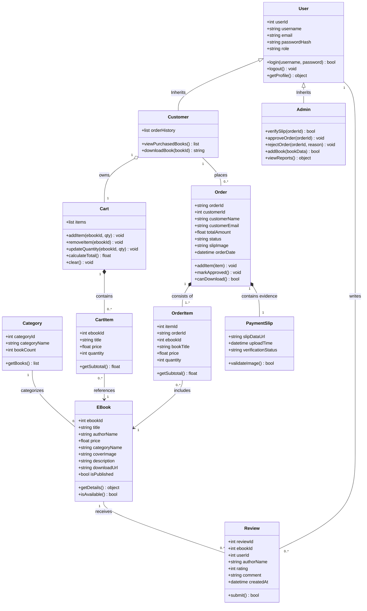
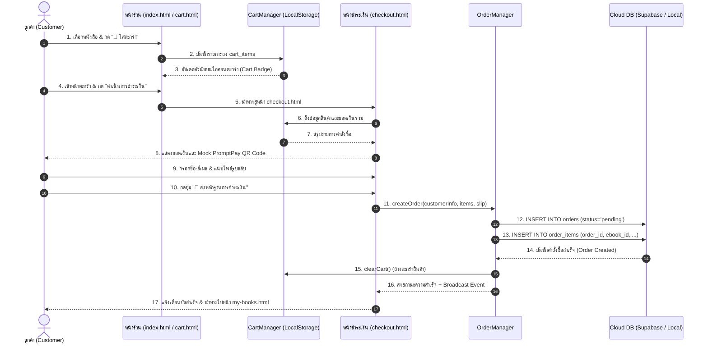
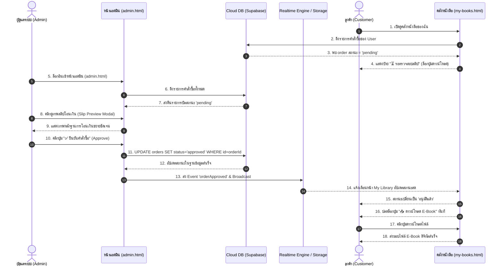
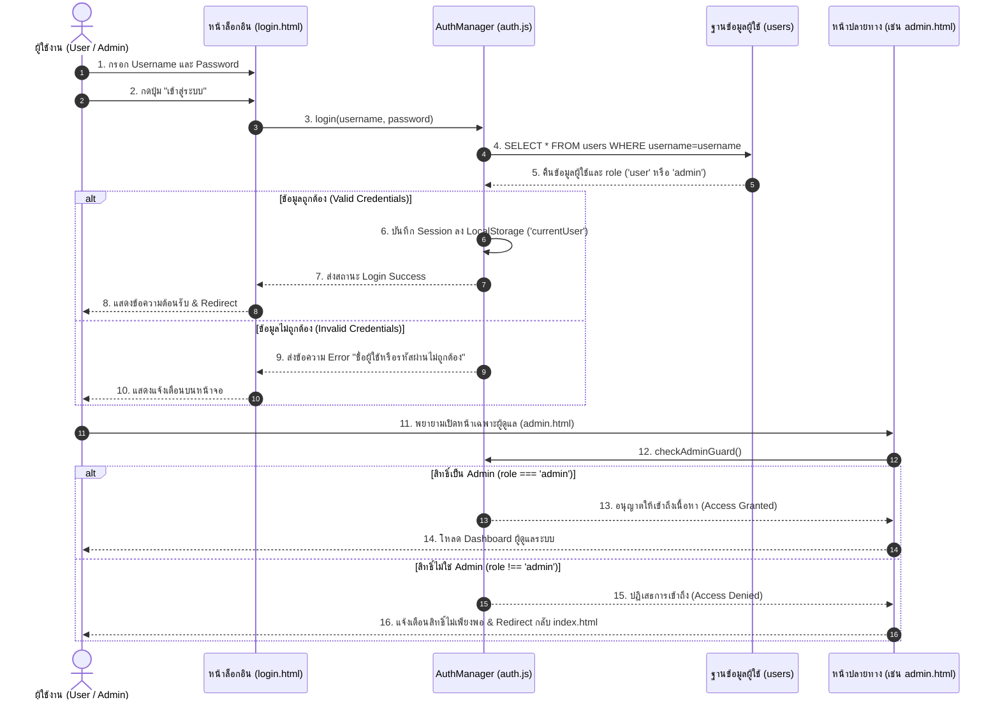

# 📐 แผนผังระบบ (Class Diagram & Sequence Diagrams)

เอกสารฉบับนี้รวบรวมแผนผังเชิงโครงสร้างและพฤติกรรมการทำงานของระบบ **Bookcool E-Book Store** โดยใช้มาตรฐาน **Mermaid Diagram** เพื่อความชัดเจนในการวิเคราะห์และพัฒนา

---

## 📑 สารบัญ
1. [Class Diagram (แผนผังคลาสและความสัมพันธ์เชิงโครงสร้าง)](#1-class-diagram)
2. [Sequence Diagram 1: กระบวนการสั่งซื้อและแนบสลิปชำระเงิน (Purchase Flow)](#2-sequence-diagram-1-purchase-flow)
3. [Sequence Diagram 2: การตรวจสอบสลิปและปลดล็อกการดาวน์โหลด (Admin Verification & Unlock Flow)](#3-sequence-diagram-2-admin-verification--unlock-flow)
4. [Sequence Diagram 3: การพิสูจน์ตัวตนและการควบคุมสิทธิ์ (Authentication & Guard Flow)](#4-sequence-diagram-3-authentication--guard-flow)

---

## 1. Class Diagram

แผนผังคลาสแสดงถึงโครงสร้างข้อมูลเชิงวัตถุ ความสัมพันธ์แบบสืบทอด (Inheritance) ความสัมพันธ์แบบรวมกลุ่ม (Composition / Aggregation) และฟังก์ชันการทำงานหลัก:

---

## 2. Sequence Diagram 1: Purchase Flow

แสดงขั้นตอนการเลือกซื้อหนังสือ การจัดการตะกร้าสินค้า การสร้างคำสั่งซื้อ และการอัปโหลดหลักฐานการโอนเงิน:

---

## 3. Sequence Diagram 2: Admin Verification & Unlock Flow

แสดงกระบวนการที่ผู้ดูแลระบบตรวจสอบหลักฐานการโอนเงิน อนุมัติคำสั่งซื้อ และส่งผลให้ระบบปลดล็อกการดาวน์โหลด E-Book:

---

## 4. Sequence Diagram 3: Authentication & Guard Flow

แสดงขั้นตอนการเข้าสู่ระบบ การตรวจสอบข้อมูล และการควบคุมสิทธิ์ตามบทบาท (RBAC Guard):

